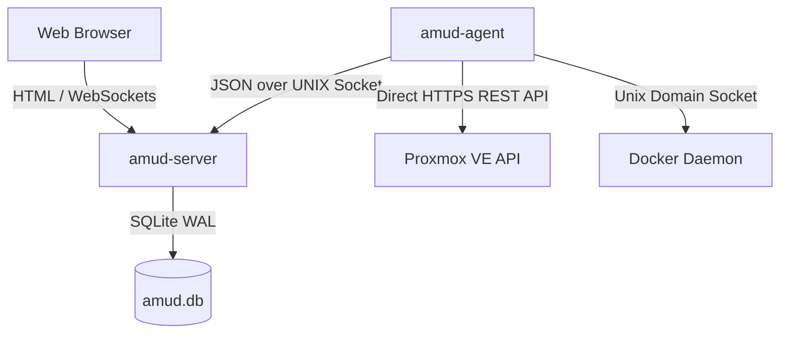

<div align="center">
  
</div>

# AMUD Dashboard

[](https://github.com/boubli/AMUD-Dashboard/releases/latest)

[English](README.md) | [Español](readmes/README.es.md) | [Português](readmes/README.pt.md) | [Français](readmes/README.fr.md) | [Deutsch](readmes/README.de.md) | [Italiano](readmes/README.it.md) | [Русский](readmes/README.ru.md) | [中文](readmes/README.zh.md) | [日本語](readmes/README.ja.md) | [हिन्दी](readmes/README.hi.md) | [한국어](readmes/README.ko.md) | [العربية](readmes/README.ar.md)

**[Changelog](https://boubli.github.io/AMUD-Dashboard/docs/changelog)** · **[Blog](https://boubli.github.io/AMUD-Dashboard/blog)** · **[Theme Gallery](https://boubli.github.io/AMUD-Dashboard/themes)** · **[Roadmap](https://boubli.github.io/AMUD-Dashboard/docs/roadmap)** · **[Docs](https://boubli.github.io/AMUD-Dashboard/)** · **[FAQ](https://boubli.github.io/AMUD-Dashboard/docs/faq)**

### What's new in v1.9.3

- **Clock timezone & format** — Dashboard clock IANA timezone + 12h/24h (Settings → Appearance)
- **Custom search engines** — Add your own web search engines alongside the built-ins ([#17](https://github.com/boubli/AMUD-Dashboard/issues/17))
- **v1.9.2** — Docs currency / **41** themes

Full history: **[Changelog](https://boubli.github.io/AMUD-Dashboard/docs/changelog)**

### Release status (2026-09-13)

Last **5** validated releases (full history: **[Changelog](https://boubli.github.io/AMUD-Dashboard/docs/changelog)**):

- `v1.9.3` (current latest recommended)
- `v1.9.2`
- `v1.9.1`
- `v1.9.0`
- `v1.8.13`

**Do not use:** `v1.8.6`, `v1.8.5` (layout), `v1.5.5.4`, `v1.5.6.1`, `v1.6.1` (withdrawn or broken).


**Unify your homelab.** A fast, Rust-powered, zero-YAML dashboard with live Proxmox & Docker telemetry, container controls, and integrations for popular self-hosted services — all from the UI.

Unlike legacy dashboards (Heimdall, Homepage, Homarr) that run on heavy runtimes (PHP-FPM, Node.js) and rely on complex nested YAML configuration files, AMUD is written in compiled Rust and persisted entirely in SQLite. Combined, the server and telemetry agent idle at **30–50 MB of RAM** (peak ~150 MB with a full integration grid) with sub-millisecond route execution.

**Homepage & Homarr parity:** AMUD ships integration cache, Homepage YAML import, Custom API widgets, LDAP, per-user boards, Plex/Jellyfin cards, and a growing long-tail catalog — see [Comparison](https://boubli.github.io/AMUD-Dashboard/docs/comparison).

## Architecture & Design Decisions

AMUD Dashboard is split into two native binaries:
1. **`amud-server`**: Axum-based web server serving server-rendered HTML (templated via Alpine.js) and managing state via SQLite.
2. **`amud-agent`**: Standalone daemon installed on the homelab host. It queries host metrics, Proxmox VE containers, and Docker runtimes, streaming raw JSON payloads back to the server via Unix Domain Sockets (UDS) or TCP.



### Technical Stack Justifications

#### Rust & Axum
* **No Runtime Overhead**: Compiles directly to native machine code. Eliminates the JVM/V8 startup and heap overhead.
* **Concurrent Event Loop (Tokio)**: Telemetry streams and third-party integrations (AdGuard, Pi-hole, Plex, Home Assistant) poll concurrently on Tokio green threads. Telemetry is serialized once per poll tick and broadcasted to WebSockets using a `tokio::sync::watch` channel.

#### SQLite Persistence (`rusqlite`)
* **Zero YAML**: Configuration is stored in an embedded SQLite database. Layouts, category tabs, and settings are configured directly via the UI, bypassing YAML syntax headaches.
* **Performance**: Configured in WAL (Write-Ahead Logging) mode, enabling concurrent reads and low-latency writes without external network overhead.

#### Direct Telemetry Collection
* **Zero Shell Subprocesses**: Legacy solutions fork system calls like `pvesh` or `curl` every few seconds to grab container stats, resulting in high CPU overhead.
* **Natively Networked**: `amud-agent` utilizes `hyper` and `rustls` to send native HTTPS REST API calls to Proxmox VE and reads the Docker daemon directly over the UNIX socket via `hyperlocal`.

---

## Telemetry Configuration

### Proxmox VE Integration
Host metrics function automatically. For LXC container monitoring, the agent must be authenticated to the Proxmox VE REST API.

#### 1. Generate API Token
In the Proxmox VE Web UI:
1. Navigate to **Datacenter → Permissions → API Tokens**.
2. Click **Add**. Select User (e.g., `root@pam`) and Token ID (e.g., `amud`).
3. **Uncheck** *Privilege Separation* so the token inherits the user's VM/System audit permissions.
4. Copy the returned Secret key.

#### 2. Pass Token to Agent
Set the environment variable on the host running the agent:
```bash
PVE_API_TOKEN=PVEAPIToken=root@pam!amud=XXXXXXXX-XXXX-XXXX-XXXX-XXXXXXXXXXXX
```

---

## Deployment

### Docker Compose

For containerized hosts on **x86_64/amd64** (combines server and agent communicating over a shared volume for the Unix socket).

**ARM64 hosts:** Docker images are amd64-only. Use [native install](https://boubli.github.io/AMUD-Dashboard/docs/installation/linux) or `update-amud.sh` with release `*-arm64` binaries instead.

```yaml
version: '3.8'

services:
  app:
    image: tradmss/amud-dashboard:latest
    container_name: amud_app
    restart: always
    ports:
      - "8000:8000"
    environment:
      - PORT=8000
      - BIND_ADDR=0.0.0.0
      - DB_PATH=/app/data/amud.db
      - PUID=99
      - PGID=100
      - AMUD_SOCKET_MODE=666
      - AMUD_SOCKET_PATH=/var/run/amud/amud.sock
      - AMUD_AGENT_SECRET=change-me-to-a-long-random-string # MUST match the agent secret below
    cap_drop:
      - ALL
    security_opt:
      - no-new-privileges:true
    volumes:
      - ./data:/app/data
      - amud_run:/var/run/amud

  agent:
    image: tradmss/amud-dashboard:latest
    container_name: amud_agent
    entrypoint: ["/app/amud-agent"]
    restart: always
    environment:
      - AMUD_SOCKET_PATH=/var/run/amud/amud.sock
      - AMUD_AGENT_SECRET=change-me-to-a-long-random-string # MUST match the app secret above
      - AMUD_DOCKER=1 # Auto-enabled when docker.sock is mounted; set 0 to disable
    cap_drop:
      - ALL
    security_opt:
      - no-new-privileges:true
    volumes:
      - amud_run:/var/run/amud
      - /var/run/docker.sock:/var/run/docker.sock:ro

volumes:
  amud_run:
    name: amud_run
```

### Unraid (Community Applications)

Official templates: **AMUD Dashboard** + **AMUD Agent** (two containers, shared socket path).

1. Install both from the **Apps** tab after templates are published.
2. Use the **same** `AMUD_AGENT_SECRET` on both containers.
3. Full guide: [Unraid installation docs](https://boubli.github.io/AMUD-Dashboard/docs/installation/unraid)

**First-boot permission error?** If the dashboard log shows `.amud-secrets-key: Permission denied`, update to **v1.7.2+** and recreate the container, or see [troubleshooting](https://boubli.github.io/AMUD-Dashboard/docs/troubleshooting#unraid-secrets-key-permission-denied) and [appdata permissions](https://boubli.github.io/AMUD-Dashboard/docs/installation/unraid#permission-errors-on-appdata).

Template XML lives in [`templates/`](templates/) with [`ca_profile.xml`](ca_profile.xml) for Community Applications submission.

### Proxmox LXC Autopilot Script
For native installation within a Proxmox VE LXC container (running outside Docker), execute this on your Proxmox VE host:
```bash
curl -sSL https://github.com/boubli/AMUD-Dashboard/releases/latest/download/setup-amud.sh | bash
```

---

## Production Resource Footprint

| Dimension | Heimdall (Legacy PHP) | AMUD Dashboard (Rust) |
| :--- | :--- | :--- |
| **Engine** | PHP 8+ / Laravel | Rust / Axum / Tokio |
| **Execution Overhead** | High (Interpreted PHP-FPM) | Zero (Native Machine Code) |
| **Asset Delivery** | Disk reads per request | Embedded in binary via `include_str!` |
| **Idle RAM Footprint** | ~150MB | **30–50 MB** (peak ~150 MB) |
| **Startup / Boot Time**| ~2 - 5 seconds | **Sub-millisecond** |

---

## For developers

Before you push Rust changes, run the same checks as GitHub CI:

```powershell
# Windows
.\scripts\ci-check.ps1
```

```bash
# Linux / macOS / Git Bash
./scripts/ci-check.sh
```

Optional: install a pre-push hook with `./scripts/install-git-hooks.sh` so `cargo fmt` failures never reach CI again.

---

## Support & Donation

**Bugs and feature requests:** [GitHub Issues](https://github.com/boubli/AMUD-Dashboard/issues) (preferred — tracked per release)  
**Questions and chat:** [GitHub Discussions](https://github.com/boubli/AMUD-Dashboard/discussions)  
**Docs / troubleshooting:** [boubli.github.io/AMUD-Dashboard/docs](https://boubli.github.io/AMUD-Dashboard)

* [GitHub Sponsors](https://github.com/sponsors/boubli)
* [Donate via Stripe](https://buy.stripe.com/cNi14n6b9a7v5Jg4Rq4ko00)
* [Ko-fi](https://ko-fi.com/Youssefboubli)
