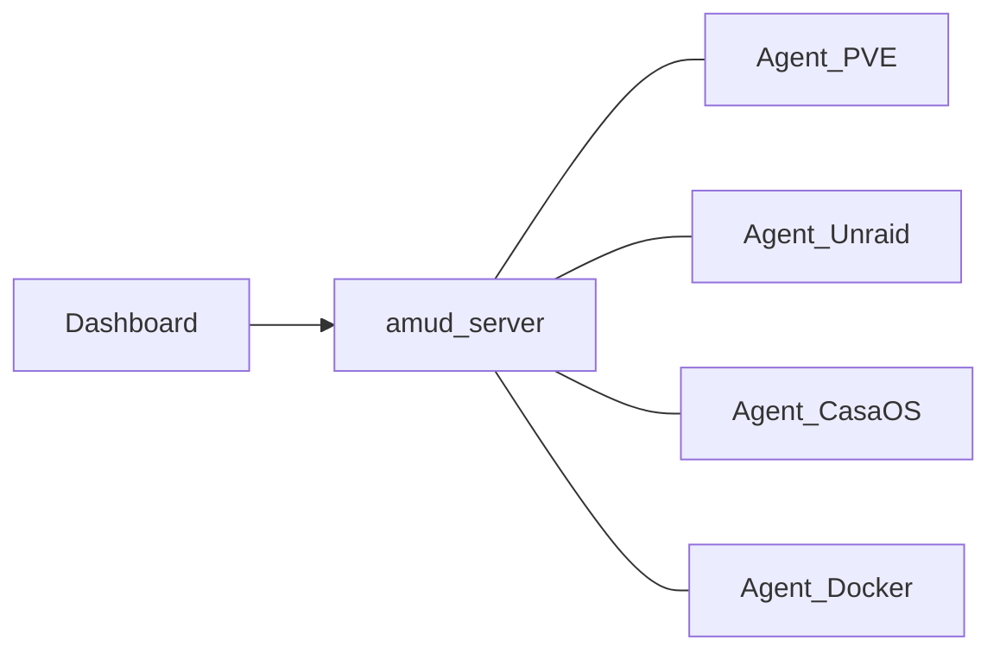

# Remote agents / multi-node

**One AMUD server. Agents on every machine you care about.**

Use this when your homelab spans more than one box — for example a Proxmox node, an Unraid NAS, a CasaOS mini-PC, and a plain Docker host. You install `amud-server` once; you install `amud-agent` on each machine. The dashboard Nodes strip shows every connected host; container start/stop goes to the agent that owns that node.



If you only have **one** host (server + agent sharing a Unix socket), you can ignore this page.

---

## What each agent can report

AMUD uses **capability profiles** (no native Unraid/CasaOS APIs yet):

| Capability | Meaning |
|---|---|
| `host` | CPU, RAM, disk, network (always) |
| `docker` | Containers + start/stop when Docker socket is available |
| `proxmox` | LXC list + controls via local Proxmox API (`localhost:8006`) |

Optional badge on the Nodes strip: `AMUD_PLATFORM=proxmox|unraid|casaos|docker`.

| Your hardware | How to wire it |
|---|---|
| Proxmox node | Agent on that host + `PVE_API_TOKEN` (talks to local PVE) |
| Unraid | Agent + Docker socket; set `AMUD_PLATFORM=unraid` |
| CasaOS | Agent + Docker socket; set `AMUD_PLATFORM=casaos` |
| Docker-only VPS/PC | Agent + Docker socket; set `AMUD_PLATFORM=docker` |

**Several Proxmox nodes** = one agent per node (each with its own tag and token).

---

## Step-by-step: add a second (or third) node

### 1. Prepare the AMUD server

Keep your existing local agent on UDS if you have one. Additionally open a TCP port for remotes:

```bash
AMUD_AGENT_SECRET=your-long-shared-secret
AMUD_AGENT_TCP_LISTEN=0.0.0.0:8050
```

- Docker / Compose: publish `8050:8050` and set the env on the **dashboard** container.
- Firewall: allow **8050/tcp** only from LAN or VPN. Never expose plain TCP to the public internet.

**Transport choice (pick one):**

| Mode | When to use | Server extras | Agent extras |
|---|---|---|---|
| Plain TCP | Tailscale, WireGuard, trusted LAN | `AMUD_AGENT_TCP_LISTEN` only | `AMUD_SERVER_ADDR` |
| TLS | Hardened LAN / no VPN | + `AMUD_AGENT_TLS=1`, cert, key | + `AMUD_AGENT_TLS=1`, CA file |

TLS example (server):

```bash
AMUD_AGENT_TLS=1
AMUD_AGENT_TLS_CERT=/opt/amud/certs/agent.crt
AMUD_AGENT_TLS_KEY=/opt/amud/certs/agent.key
```

```bash
openssl req -x509 -newkey rsa:2048 -nodes \
  -keyout agent.key -out agent.crt -days 825 \
  -subj "/CN=amud.lan"
```

### 2. Install agent-only on the remote host

Do **not** run a second `amud-server`.

```bash
AMUD_SERVER_ADDR=amud.lan:8050     # or Tailscale IP / MagicDNS name
AMUD_NODE_TAG=unraid-1             # REQUIRED — unique per host
AMUD_AGENT_SECRET=your-long-shared-secret
AMUD_PLATFORM=unraid               # optional
# Docker hosts:
#   mount /var/run/docker.sock
# Proxmox hosts:
#   PVE_API_TOKEN=user@pam!id=...
#   PVE_NODE=pve                   # optional; defaults to hostname
```

TLS client:

```bash
AMUD_AGENT_TLS=1
AMUD_AGENT_TLS_CA=/path/to/agent.crt   # or your CA
# Lab only (discouraged): AMUD_AGENT_TLS_INSECURE=1
```

### 3. Wire apps in the dashboard

1. Open the dashboard — the **Nodes** strip lists online tags (CPU/RAM, capabilities).
2. Click a node to drive the host telemetry cards (CPU / RAM / GPU / disk).
3. Edit each app → **Node tag** = the agent tag that runs that container (`unraid-1`, `pve2`, …).
4. Start/stop/restart now targets that agent only.

Settings → Performance also shows a **Remote agents** snippet you can copy.

### 4. Verify

- Nodes strip shows the new tag as online.
- App cards for that tag get live container status.
- Controls on those cards succeed (agent must stay connected).

---

## Environment reference

### Server (`amud-server`)

| Variable | Purpose | Default |
|---|---|---|
| `AMUD_AGENT_SECRET` | Shared IPC secret (required) | — |
| `AMUD_SOCKET_PATH` | Local UDS path (Unix) | `/opt/amud/run/amud.sock` |
| `AMUD_AGENT_TCP_LISTEN` | Bind for remote agents, e.g. `0.0.0.0:8050` | off (Unix); Windows uses `AMUD_TCP_ADDR` |
| `AMUD_AGENT_TLS` | `1` = TLS on the TCP listener | off |
| `AMUD_AGENT_TLS_CERT` | PEM certificate | required if TLS |
| `AMUD_AGENT_TLS_KEY` | PEM private key | required if TLS |

### Agent (`amud-agent`)

| Variable | Purpose | Default |
|---|---|---|
| `AMUD_AGENT_SECRET` | Same secret as server | required |
| `AMUD_SOCKET_PATH` | Local UDS (when not using TCP) | `/opt/amud/run/amud.sock` |
| `AMUD_SERVER_ADDR` | `host:port` of the AMUD server (remote mode) | unset = UDS/local |
| `AMUD_NODE_TAG` | Unique node id (**required** with `AMUD_SERVER_ADDR`) | from server config / `Local` |
| `AMUD_PLATFORM` | Badge: `proxmox` / `unraid` / `casaos` / `docker` | empty |
| `AMUD_DOCKER` | `0` disable / `1` force Docker | auto if socket exists |
| `PVE_API_TOKEN` | Proxmox API token on that host | unset |
| `PVE_NODE` | PVE node name | `/etc/hostname` |
| `AMUD_AGENT_TLS` | Use TLS to the server | off |
| `AMUD_AGENT_TLS_CA` | Trust store / server cert PEM | required if TLS (unless insecure) |
| `AMUD_AGENT_TLS_INSECURE` | Skip cert verify (lab only) | off |

### Settings UI (local defaults)

| Setting | Where | Notes |
|---|---|---|
| Default local agent node tag | Settings → Performance | Used when the co-located agent has no `AMUD_NODE_TAG` |
| App **Node tag** | Add/Edit app | Must match an agent tag for metrics + controls |
| Proxmox token / enable | Settings → Infrastructure | Pushed to connected agents; remotes should prefer their own `PVE_API_TOKEN` env |
| Poll intervals | Settings → Performance | Shared cadence hints pushed in agent config |

---

## Docker Compose — remote agent only

```yaml
services:
  amud-agent:
    image: tradmss/amud-agent:latest
    environment:
      AMUD_SERVER_ADDR: "amud.lan:8050"
      AMUD_NODE_TAG: "docker-box"
      AMUD_AGENT_SECRET: "your-long-shared-secret"
      AMUD_PLATFORM: "docker"
    volumes:
      - /var/run/docker.sock:/var/run/docker.sock
    restart: unless-stopped
```

On the **server** compose stack, add `AMUD_AGENT_TCP_LISTEN=0.0.0.0:8050` and publish port `8050`.

---

## Troubleshooting

| Symptom | Fix |
|---|---|
| `AMUD_NODE_TAG is required` | Set a unique tag whenever `AMUD_SERVER_ADDR` is set |
| `node_tag already connected` | Two agents share a tag — rename one and restart |
| Node never appears | Secret mismatch, firewall, or server missing `AMUD_AGENT_TCP_LISTEN` |
| Metrics OK, controls fail | App node tag ≠ agent tag, or that agent disconnected |
| TLS handshake fails | Agent `AMUD_AGENT_TLS_CA` must trust the server cert |
| Wrong host metrics | Select the correct chip in the Nodes strip |

---

## Related install guides

- [Docker](./docker) · [Unraid](./unraid) · [Proxmox](./proxmox) · [Linux](./linux)
- Changelog: **v1.9.4 — Multi-node agents**
