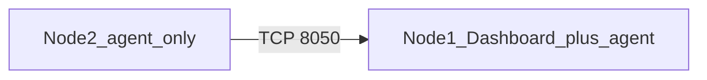

# Add a second host (agent only)

You already have **AMUD Dashboard + agent on Node 1**. Now you want **only `amud-agent` on Node 2**, talking to the dashboard on Node 1.

Do **not** install a second `amud-server` / dashboard on Node 2.



Full guide also lives under **Settings → Infrastructure → Agents / Nodes** (copy-paste env snippets).

## Prerequisites

| Item | Where |
|---|---|
| Working dashboard | Node 1 |
| Same `AMUD_AGENT_SECRET` | Node 1 server **and** both agents |
| Reachable address | Node 2 → Node 1 IP / hostname / Tailscale MagicDNS on port **8050** |
| Unique tag | Every remote agent needs its own `AMUD_NODE_TAG` |

---

## Step 1 — Prepare Node 1 (dashboard)

On the **dashboard / `amud-server`** process, enable TCP listen (and keep the secret you already use):

```bash
AMUD_AGENT_TCP_LISTEN=0.0.0.0:8050
AMUD_AGENT_SECRET=your-long-shared-secret
```

| Install on Node 1 | What to do |
|---|---|
| **Docker / Compose** | Add the env vars, publish/map port **8050**, recreate the dashboard container |
| **Unraid CA** | Edit **AMUD-Dashboard** → add `AMUD_AGENT_TCP_LISTEN=0.0.0.0:8050` → Apply |
| **Native / Proxmox** | Put the vars in the server unit/env, `systemctl restart amud-server` |

Firewall / VPN: allow **8050/tcp** from Node 2 only (LAN or Tailscale). Prefer VPN; for TLS see [TCP & TLS](./tcp-and-tls).

---

## Step 2 — Install agent-only on Node 2

Pick **one** method for Node 2. Replace `amud.lan` with Node 1’s address and use a unique tag (`unraid-1`, `pve-2`, `docker-box`, …).

### A) Docker / Compose (any Linux Docker host)

```yaml
services:
  amud-agent:
    image: tradmss/amud-dashboard:latest
    entrypoint: ["/app/amud-agent"]
    network_mode: host
    environment:
      AMUD_SERVER_ADDR: "amud.lan:8050"   # Node 1
      AMUD_NODE_TAG: "node-2"             # unique
      AMUD_AGENT_SECRET: "your-long-shared-secret"
      AMUD_PLATFORM: "docker"             # optional badge
      AMUD_DOCKER: "1"
    volumes:
      - /var/run/docker.sock:/var/run/docker.sock
    restart: unless-stopped
```

```bash
docker compose up -d
```

No shared Unix socket with Node 1 — remote mode uses `AMUD_SERVER_ADDR` only.

### B) Unraid (Community Applications)

1. On **Node 2**, Apps → install **AMUD-Agent** (not AMUD-Dashboard).
2. Set **Agent Secret** = same value as Node 1.
3. Keep **network: host** and the Docker socket mount.
4. Add these variables (Add another Path, Port, Variable…):

| Variable | Example |
|---|---|
| `AMUD_SERVER_ADDR` | `192.168.1.10:8050` or `amud.lan:8050` |
| `AMUD_NODE_TAG` | `unraid-2` |
| `AMUD_PLATFORM` | `unraid` |

5. You do **not** need a shared socket folder with Node 1’s appdata. For a remote agent, the socket path is unused; TCP to Node 1 is what matters.
6. Apply / start the container. Check **Docker → AMUD-Agent → Log** for a successful connect.

### C) Native Linux binary (systemd)

On Node 2 only — download **agent** binary, no server:

```bash
# amd64
curl -sSL -o amud-agent \
  https://github.com/boubli/AMUD-Dashboard/releases/latest/download/amud-agent
# arm64: use amud-agent-arm64 instead

chmod +x amud-agent
sudo mv amud-agent /usr/local/bin/
```

Create `/etc/systemd/system/amud-agent.service`:

```ini
[Unit]
Description=AMUD Host Telemetry Agent (remote)
After=network-online.target
Wants=network-online.target

[Service]
Type=simple
User=root
ExecStart=/usr/local/bin/amud-agent
Restart=always
RestartSec=5
Environment=AMUD_SERVER_ADDR=amud.lan:8050
Environment=AMUD_NODE_TAG=node-2
Environment=AMUD_AGENT_SECRET=your-long-shared-secret
Environment=AMUD_PLATFORM=docker
Environment=AMUD_DOCKER=1

[Install]
WantedBy=multi-user.target
```

```bash
sudo systemctl daemon-reload
sudo systemctl enable --now amud-agent
sudo journalctl -u amud-agent -f -n 50
```

### D) Proxmox host

Same as **Native** (C), or drop the binary on the hypervisor. Add:

```bash
Environment=AMUD_PLATFORM=proxmox
Environment=PVE_API_TOKEN=user@pam!tokenid=secret
# Environment=PVE_NODE=pve   # optional
```

The agent calls `https://localhost:8006` on **that** Proxmox node. See [Platforms](./platforms).

---

## Step 3 — Wire apps in the dashboard (Node 1 UI)

1. Open the dashboard on Node 1. With two agents online, the **Nodes** strip appears.
2. Edit each app that runs on Node 2 → set **Node tag** = that agent’s `AMUD_NODE_TAG`.
3. Start/stop/restart on those cards targets Node 2 only.

---

## Step 4 — Verify

**Settings → Infrastructure → Agents / Nodes**

- Node 1 tag (often `Local`) and Node 2 tag both **Online**
- Platform / capabilities look right
- Refresh shows CPU/RAM for the selected node

---

## Environment quick reference

### Node 1 — server

| Variable | Purpose |
|---|---|
| `AMUD_AGENT_SECRET` | Shared IPC secret |
| `AMUD_SOCKET_PATH` | Local UDS for the co-located agent on Node 1 |
| `AMUD_AGENT_TCP_LISTEN` | e.g. `0.0.0.0:8050` so Node 2 can connect |
| `AMUD_AGENT_TLS` / `CERT` / `KEY` | Optional TLS — [TCP & TLS](./tcp-and-tls) |

### Node 2 — agent only

| Variable | Purpose |
|---|---|
| `AMUD_SERVER_ADDR` | `host:port` of Node 1 (**required** for remote mode) |
| `AMUD_NODE_TAG` | Unique id (**required** with `AMUD_SERVER_ADDR`) |
| `AMUD_AGENT_SECRET` | Must match Node 1 |
| `AMUD_PLATFORM` | Cosmetic: `proxmox` / `unraid` / `casaos` / `docker` |
| `AMUD_DOCKER` | `1` recommended when Docker socket is mounted |
| `PVE_API_TOKEN` / `PVE_NODE` | Proxmox on that host |

See also: [Platforms](./platforms) · [Controls](./controls) · [Troubleshooting](./troubleshooting)
