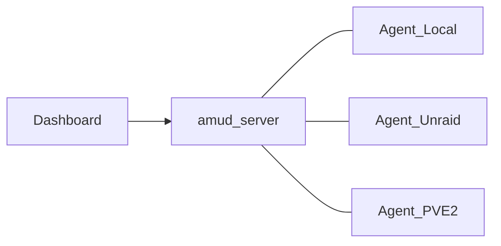

# Multi-node agents — overview

**One `amud-server`. Agents on every machine you care about.**

Use multi-node when your homelab spans more than one box — for example a Proxmox node, an Unraid NAS, a CasaOS mini-PC, and a plain Docker host. You install the dashboard once; you install `amud-agent` on each machine.

## When you need it

| Setup | Multi-node? |
|---|---|
| Single host (server + agent share a Unix socket) | No — leave defaults |
| Second Unraid / Proxmox / Docker box | Yes |
| Several Proxmox nodes | Yes — one agent per node |

## Dashboard behavior

- With **one** connected agent, the dashboard looks like a normal single-host install. The **Nodes** strip is **hidden**.
- With **two or more** agents online, the **Nodes** strip appears so you can pick which host drives the CPU/RAM/GPU/disk cards.
- Container start/stop always routes by each app’s **Node tag**, even when the strip is hidden.

## Where to manage it in the UI

**Settings → Infrastructure → Agents / Nodes**

- Live table of tags, online status, platform, capabilities, CPU/RAM
- Copy-paste env for server listen (VPN/TCP or TLS) and remote agents
- Links into this documentation section

## Capability profiles

Agents report what they can see (no native Unraid/CasaOS APIs yet):

| Capability | Meaning |
|---|---|
| `host` | CPU, RAM, disk, network |
| `docker` | Containers + controls when the Docker socket is available |
| `proxmox` | LXC list + controls via local Proxmox API |

Optional badge: `AMUD_PLATFORM=proxmox|unraid|casaos|docker`.

## Typical path (Node 1 already installed)

1. Enable `AMUD_AGENT_TCP_LISTEN` on Node 1
2. On Node 2 install **agent only** (Docker / Unraid CA / native binary) with `AMUD_SERVER_ADDR` + unique `AMUD_NODE_TAG`
3. Set each app’s **Node tag** in the UI

Step-by-step: **[Add a second host (agent only)](./connect)**

## Next steps

1. [Add a second host — agent only](./connect)
2. Choose [TCP vs TLS](./tcp-and-tls)
3. See [platform recipes](./platforms)
4. Learn [dashboard controls](./controls)
5. [Troubleshooting](./troubleshooting)
