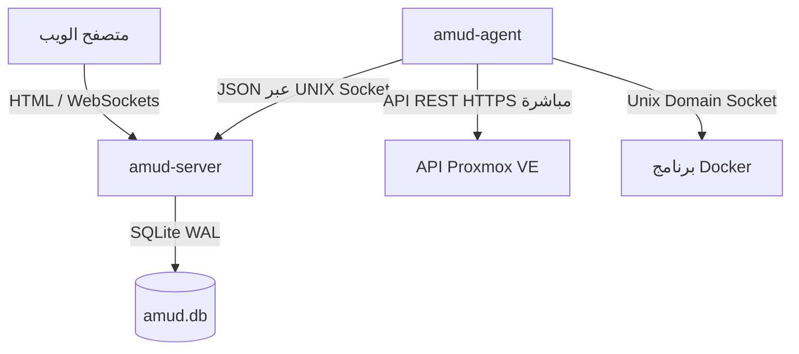

<div align="center">
  
</div>

# AMUD Dashboard

[](https://github.com/boubli/AMUD-Dashboard/releases/latest)

[English](../README.md) | [Español](README.es.md) | [Português](README.pt.md) | [Français](README.fr.md) | [Deutsch](README.de.md) | [Italiano](README.it.md) | [Русский](README.ru.md) | [中文](README.zh.md) | [日本語](README.ja.md) | [हिन्दी](README.hi.md) | [한국어](README.ko.md) | [العربية](README.ar.md)

**[سجل التغييرات](https://boubli.github.io/AMUD-Dashboard/docs/changelog)** · **[المدونة](https://boubli.github.io/AMUD-Dashboard/blog)** · **[معرض السمات](https://boubli.github.io/AMUD-Dashboard/themes)** · **[خارطة الطريق](https://boubli.github.io/AMUD-Dashboard/docs/roadmap)** · **[المستندات](https://boubli.github.io/AMUD-Dashboard/)** · **[الأسئلة الشائعة](https://boubli.github.io/AMUD-Dashboard/docs/faq)**

### الجديد في v1.9.3

- **Clock timezone & format** — Dashboard clock IANA timezone + 12h/24h
- **Custom search engines** — Add your own web search engines (#17)
- **v1.9.2** — Docs currency / 41 themes

السجل الكامل: **[سجل التغييرات](https://boubli.github.io/AMUD-Dashboard/docs/changelog)**

### حالة الإصدار

الإصدار الموصى به: **1.9.3**. التفاصيل والإصدارات المسحوبة: **[README الإنجليزي](../README.md)** (قسم Release status).


**وحّد مختبرك المنزلي.** لوحة تحكم سريعة مبنية بلغة Rust وبدون YAML، مع قياس عن بُعد مباشر لـ Proxmox وDocker، وأدوات للتحكم بالحاويات، وتكاملات مع أشهر الخدمات المستضافة ذاتيًا — كل ذلك من الواجهة.

على عكس لوحات التحكم القديمة (Heimdall، Homepage، Homarr) التي تعمل على بيئات تشغيل ثقيلة (PHP-FPM، Node.js) وتعتمد على ملفات تكوين YAML المعقدة والمتداخلة، فإن AMUD مكتوب بلغة Rust المجمعة ويتم حفظ البيانات بالكامل في SQLite. في وضع الخمول، يستهلك الخادم ووكيل القياس عن بعد **30–50 ميجابايت RAM** (ذروة ~150 ميجابايت مع شبكة تكامل كاملة) مع وقت تنفيذ للمسارات أقل من جزء من الملي ثانية.

## الهندسة المعمارية وقرارات التصميم

ينقسم لوحة تحكم AMUD إلى برنامجين أصليين:
1. **`amud-server`**: خادم ويب يعتمد على Axum لتقديم صفحات HTML التي يتم تقديمها على الخادم (باستخدام قوالب Alpine.js) وإدارة الحالة عبر SQLite.
2. **`amud-agent`**: برنامج تشغيل مستقل مثبت على مضيف homelab. يقوم بالاستعلام عن مقاييس المضيف وحاويات Proxmox VE وبيئات تشغيل Docker، وإرسال البيانات بتنسيق JSON إلى الخادم عبر Sockets الخاصة بـ UNIX أو TCP.



### مبررات التكنولوجيا المستخدمة

#### Rust و Axum
* **لا يوجد عبء في وقت التشغيل**: يتم تجميعه مباشرة إلى كود الآلة الأصلي، مما يلغي وقت بدء التشغيل والعبء المخصص للذاكرة (heap) الخاص بـ JVM/V8.
* **حلقة الأحداث المتزامنة (Tokio)**: يتم الاستعلام عن تدفقات القياس عن بعد والتكاملات الخارجية (AdGuard، Pi-hole، Plex، Home Assistant) بالتوازي على خيوط Tokio الخضراء. يتم تسلسل البيانات مرة واحدة في كل دورة وبثها إلى WebSockets باستخدام قناة `tokio::sync::watch`.

#### تخزين SQLite (`rusqlite`)
* **بدون YAML**: يتم تخزين التكوين في قاعدة بيانات SQLite مدمجة. يتم تكوين التخطيطات وعلامات التبويب والإعدادات مباشرة عبر واجهة المستخدم، لتجنب مشاكل بناء جملة YAML.
* **الأداء**: تم تكوينه في وضع WAL (Write-Ahead Logging)، مما يسمح بالقراءة المتزامنة والكتابة منخفضة زمن الوصول دون أي عبء شبكي خارجي.

#### جمع القياس عن بعد المباشر
* **بدون عمليات فرعية**: تقوم الحلول القديمة بتشغيل استدعاءات النظام مثل `pvesh` أو `curl` كل بضع ثوان للحصول على إحصائيات الحاوية، مما يؤدي إلى زيادة استهلاك المعالج (CPU).
* **شبكة أصلية**: يستخدم `amud-agent` مكتبات `hyper` و `rustls` لإرسال استدعاءات API REST HTTPS الأصلية إلى Proxmox VE ويقرأ برنامج Docker مباشرة عبر Unix Socket باستخدام `hyperlocal`.

---

## تكوين القياس عن بعد

### تكامل Proxmox VE

تعمل مقاييس المضيف تلقائيًا. لمراقبة حاويات LXC، يجب أن يكون الوكيل معتمدًا لدى Proxmox VE REST API.

#### 1. إنشاء رمز API

في واجهة مستخدم ويب Proxmox VE:
1. انتقل إلى **Datacenter ← Permissions ← API Tokens**.
2. انقر فوق **Add**. حدد المستخدم (على سبيل المثال، `root@pam`) ومعرف الرمز (على سبيل المثال، `amud`).
3. **قم بإلغاء تحديد** *Privilege Separation* ليرث الرمز أذونات تدقيق النظام وVM الخاصة بالمستخدم.
4. انسخ المفتاح السري الناتج.

#### 2. تمرير الرمز للوكيل

قم بتعيين متغير البيئة على المضيف الذي يقوم بتشغيل الوكيل:
```bash
PVE_API_TOKEN=PVEAPIToken=root@pam!amud=XXXXXXXX-XXXX-XXXX-XXXX-XXXXXXXXXXXX
```

---

## النشر

### Docker Compose

للمضيفين الذين يعملون داخل حاويات (يجمع بين الخادم والوكيل اللذين يتصلان عبر حجم مشترك لمقبس Unix):

```yaml
version: '3.8'

services:
  app:
    image: tradmss/amud-dashboard:latest
    container_name: amud_app
    restart: always
    ports:
      - "8000:8000"
    environment:
      - PORT=8000
      - BIND_ADDR=0.0.0.0
      - DB_PATH=/app/data/amud.db
      - AMUD_SOCKET_PATH=/var/run/amud/amud.sock
      - AMUD_AGENT_SECRET=change-me-to-a-long-random-string # يجب أن يتطابق مع سر الوكيل أدناه
    cap_drop:
      - ALL
    security_opt:
      - no-new-privileges:true
    volumes:
      - ./data:/app/data
      - amud_run:/var/run/amud

  agent:
    image: tradmss/amud-dashboard:latest
    container_name: amud_agent
    entrypoint: ["/app/amud-agent"]
    restart: always
    environment:
      - AMUD_SOCKET_PATH=/var/run/amud/amud.sock
      - AMUD_AGENT_SECRET=change-me-to-a-long-random-string # يجب أن يتطابق مع السر أعلاه
      - AMUD_DOCKER=1 # يُفعَّل تلقائيًا عند mount لـ docker.sock؛ اضبط 0 للتعطيل
    cap_drop:
      - ALL
    security_opt:
      - no-new-privileges:true
    volumes:
      - amud_run:/var/run/amud
      - /var/run/docker.sock:/var/run/docker.sock:ro

volumes:
  amud_run:
    name: amud_run
```

### Unraid (تطبيقات المجتمع)

القوالب الرسمية: **AMUD Dashboard** + **AMUD Agent** (حاويتان، مسار مقبس مشترك).

1. قم بتثبيت كليهما من علامة التبويب **Apps** بعد نشر القوالب.
2. استخدم نفس `AMUD_AGENT_SECRET` في كلتا الحاويتين.
3. الدليل الكامل: [مستندات التثبيت على Unraid](https://boubli.github.io/AMUD-Dashboard/docs/installation/unraid)

**خطأ صلاحيات عند أول تشغيل؟** إذا ظهر في السجل `.amud-secrets-key: Permission denied`، حدّث إلى **v1.7.2+** وأعد إنشاء الحاوية، أو راجع [استكشاف الأخطاء](https://boubli.github.io/AMUD-Dashboard/docs/troubleshooting#unraid-secrets-key-permission-denied) و[صلاحيات appdata](https://boubli.github.io/AMUD-Dashboard/docs/installation/unraid#permission-errors-on-appdata).

يوجد ملف القالب XML في [`templates/`](templates/) مع [`ca_profile.xml`](ca_profile.xml) للإرسال إلى تطبيقات المجتمع.

### برنامج التثبيت التلقائي لـ Proxmox LXC

للتثبيت الأصلي داخل حاوية Proxmox VE LXC (تعمل خارج Docker)، قم بتشغيل هذا على مضيف Proxmox VE الخاص بك:
```bash
curl -sSL https://github.com/boubli/AMUD-Dashboard/releases/latest/download/setup-amud.sh | bash
```

---

## استهلاك الموارد في بيئة التشغيل الفعلية

| البعد | Heimdall (PHP القديم) | AMUD Dashboard (Rust) |
| :--- | :--- | :--- |
| **المحرك** | PHP 8+ / Laravel | Rust / Axum / Tokio |
| **عبء التنفيذ** | مرتفع (PHP-FPM مفسر) | صفر (كود الآلة الأصلي) |
| **تسليم الأصول** | قراءات القرص لكل طلب | مدمج في الثنائي عبر `include_str!` |
| **حجم الذاكرة في وضع الخمول** | ~150 ميجابايت | **30–50 ميجابايت** (ذروة ~150 ميجابايت) |
| **وقت بدء التشغيل**| ~2 - 5 ثوانٍ | **أقل من جزء من الملي ثانية** |

---

## الدعم والتبرع

**الأخطاء وطلبات الميزات:** [GitHub Issues](https://github.com/boubli/AMUD-Dashboard/issues) (مفضّل — متابعة لكل إصدار)  
**الأسئلة والمحادثة:** [GitHub Discussions](https://github.com/boubli/AMUD-Dashboard/discussions)  
**المستندات / استكشاف الأخطاء:** [boubli.github.io/AMUD-Dashboard/docs](https://boubli.github.io/AMUD-Dashboard/docs)

* [رعاة GitHub](https://github.com/sponsors/boubli)
* [تبرع عبر Stripe](https://buy.stripe.com/cNi14n6b9a7v5Jg4Rq4ko00)
* [Ko-fi](https://ko-fi.com/Youssefboubli)
