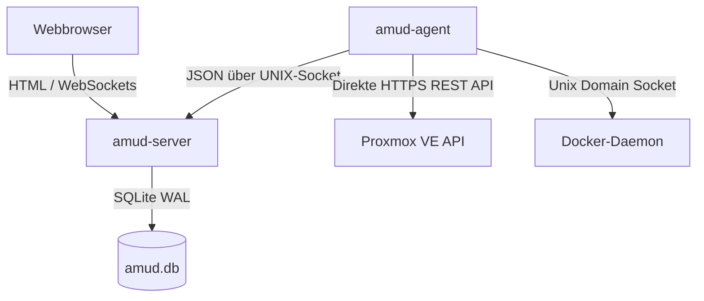

<div align="center">
  
</div>

# AMUD Dashboard

[](https://github.com/boubli/AMUD-Dashboard/releases/latest)

[English](../README.md) | [Español](README.es.md) | [Português](README.pt.md) | [Français](README.fr.md) | [Deutsch](README.de.md) | [Italiano](README.it.md) | [Русский](README.ru.md) | [中文](README.zh.md) | [日本語](README.ja.md) | [हिन्दी](README.hi.md) | [한국어](README.ko.md) | [العربية](README.ar.md)

**[Changelog](https://boubli.github.io/AMUD-Dashboard/docs/changelog)** · **[Blog](https://boubli.github.io/AMUD-Dashboard/blog)** · **[Theme-Galerie](https://boubli.github.io/AMUD-Dashboard/themes)** · **[Roadmap](https://boubli.github.io/AMUD-Dashboard/docs/roadmap)** · **[Dokumentation](https://boubli.github.io/AMUD-Dashboard/)** · **[FAQ](https://boubli.github.io/AMUD-Dashboard/docs/faq)**

### Was ist neu in v1.9.3

- **Clock timezone & format** — Dashboard clock IANA timezone + 12h/24h
- **Custom search engines** — Add your own web search engines (#17)
- **v1.9.2** — Docs currency / 41 themes

Vollständiger Verlauf: **[Changelog](https://boubli.github.io/AMUD-Dashboard/docs/changelog)**

### Release-Status

Aktuell empfohlen: **1.9.3**. Details und zurückgezogene Tags: **[englisches README](../README.md)** (Abschnitt Release status).


**Vereine dein Homelab.** Ein schnelles, in Rust geschriebenes Dashboard ohne YAML – mit Live-Telemetrie für Proxmox und Docker, Container-Steuerung und Integrationen für beliebte selbstgehostete Dienste, alles über die Oberfläche.

Im Gegensatz zu älteren Dashboards (Heimdall, Homepage, Homarr), die auf schwerfälligen Laufzeiten (PHP-FPM, Node.js) laufen und auf komplexen verschachtelten YAML-Konfigurationsdateien basieren, ist AMUD in kompiliertem Rust geschrieben und wird vollständig in SQLite gespeichert. Zusammen verbrauchen Server und Telemetrie-Agent im Leerlauf **30–50 MB RAM** (Spitze ~150 MB mit vollem Integrationsraster) bei einer Routenausführung im Sub-Millisekundenbereich.

## Architektur & Design-Entscheidungen

Das AMUD Dashboard ist in zwei native Binärdateien aufgeteilt:
1. **`amud-server`**: Axum-basierter Webserver, der serverseitig gerendertes HTML (über Alpine.js templated) bereitstellt und den Zustand via SQLite verwaltet.
2. **`amud-agent`**: Eigenständiger Daemon, der auf dem Homelab-Host installiert wird. Er fragt Host-Metriken, Proxmox VE-Container und Docker-Laufzeiten ab und streamt rohe JSON-Nutzdaten über Unix-Domain-Sockets (UDS) oder TCP zurück an den Server.



### Begründung des technischen Stacks

#### Rust & Axum
* **Kein Runtime-Overhead**: Kompiliert direkt in nativen Maschinencode. Eliminiert den JVM/V8-Start- und Heap-Overhead.
* **Konkurrierende Ereignisschleife (Tokio)**: Telemetrie-Streams und Drittanbieter-Integrationen (AdGuard, Pi-hole, Plex, Home Assistant) werden konkurrierend auf Tokio-Grün-Threads abgefragt. Telemetrie wird einmal pro Abfrage-Intervall serialisiert und über einen `tokio::sync::watch`-Kanal an WebSockets übertragen.

#### SQLite-Persistenz (`rusqlite`)
* **Null YAML**: Die Konfiguration wird in einer eingebetteten SQLite-Datenbank gespeichert. Layouts, Kategorie-Tabs und Einstellungen werden direkt über die Benutzeroberfläche konfiguriert, was YAML-Syntax-Kopfschmerzen vermeidet.
* **Leistung**: Konfiguriert im WAL-Modus (Write-Ahead Logging), was konkurrierende Lesezugriffe und Schreibvorgänge mit geringer Latenz ohne externen Netzwerk-Overhead ermöglicht.

#### Direkte Telemetrie-Erfassung
* **Null Shell-Subprozesse**: Ältere Lösungen forken alle paar Sekunden Systemaufrufe wie `pvesh` oder `curl`, um Container-Statistiken abzurufen, was zu einem hohen CPU-Overhead führt.
* **Nativ vernetzt**: `amud-agent` verwendet `hyper` und `rustls`, um native HTTPS-REST-API-Aufrufe an Proxmox VE zu senden, und liest den Docker-Daemon direkt über den UNIX-Socket via `hyperlocal`.

---

## Telemetrie-Konfiguration

### Proxmox VE-Integration

Host-Metriken funktionieren automatisch. Für die LXC-Container-Überwachung muss sich der Agent an der Proxmox VE-REST-API authentifizieren.

#### 1. API-Token generieren

In der Proxmox VE-Web-Benutzeroberfläche:
1. Navigieren Sie zu **Rechenzentrum → Berechtigungen → API-Token**.
2. Klicken Sie auf **Hinzufügen**. Wählen Sie den Benutzer (z. B. `root@pam`) und die Token-ID (z. B. `amud`).
3. **Deaktivieren** Sie *Privilegentrennung*, damit der Token die VM/System-Audit-Berechtigungen des Benutzers erbt.
4. Kopieren Sie den zurückgegebenen Geheimschlüssel.

#### 2. Token an Agent übergeben

Setzen Sie die Umgebungsvariable auf dem Host, auf dem der Agent läuft:
```bash
PVE_API_TOKEN=PVEAPIToken=root@pam!amud=XXXXXXXX-XXXX-XXXX-XXXX-XXXXXXXXXXXX
```

---

## Bereitstellung

### Docker Compose

Für containerisierte Hosts (kombiniert Server und Agent, die über ein gemeinsam genutztes Volume für den Unix-Socket kommunizieren):

```yaml
version: '3.8'

services:
  app:
    image: tradmss/amud-dashboard:latest
    container_name: amud_app
    restart: always
    ports:
      - "8000:8000"
    environment:
      - PORT=8000
      - BIND_ADDR=0.0.0.0
      - DB_PATH=/app/data/amud.db
      - AMUD_SOCKET_PATH=/var/run/amud/amud.sock
      - AMUD_AGENT_SECRET=change-me-to-a-long-random-string # MUSS mit dem Agent-Geheimnis unten übereinstimmen
    cap_drop:
      - ALL
    security_opt:
      - no-new-privileges:true
    volumes:
      - ./data:/app/data
      - amud_run:/var/run/amud

  agent:
    image: tradmss/amud-dashboard:latest
    container_name: amud_agent
    entrypoint: ["/app/amud-agent"]
    restart: always
    environment:
      - AMUD_SOCKET_PATH=/var/run/amud/amud.sock
      - AMUD_AGENT_SECRET=change-me-to-a-long-random-string # MUSS mit dem App-Geheimnis oben übereinstimmen
      - AMUD_DOCKER=1 # Automatisch aktiv, wenn docker.sock gemountet ist; 0 zum Deaktivieren
    cap_drop:
      - ALL
    security_opt:
      - no-new-privileges:true
    volumes:
      - amud_run:/var/run/amud
      - /var/run/docker.sock:/var/run/docker.sock:ro

volumes:
  amud_run:
    name: amud_run
```

### Unraid (Community Applications)

Offizielle Vorlagen: **AMUD Dashboard** + **AMUD Agent** (zwei Container, gemeinsam genutzter Socket-Pfad).

1. Installieren Sie beide über den Reiter **Apps**, sobald die Vorlagen veröffentlicht sind.
2. Verwenden Sie das **gleiche** `AMUD_AGENT_SECRET` für beide Container.
3. Vollständige Anleitung: [Unraid Installationsanleitung](https://boubli.github.io/AMUD-Dashboard/docs/installation/unraid)

**Berechtigungsfehler beim ersten Start?** Steht im Log `.amud-secrets-key: Permission denied`, auf **v1.7.2+** aktualisieren und den Container neu erstellen — oder [Troubleshooting](https://boubli.github.io/AMUD-Dashboard/docs/troubleshooting#unraid-secrets-key-permission-denied) und [Appdata-Berechtigungen](https://boubli.github.io/AMUD-Dashboard/docs/installation/unraid#permission-errors-on-appdata).

Die Vorlagen-XMLs befinden sich in [`templates/`](templates/) mit [`ca_profile.xml`](ca_profile.xml) für die Einreichung bei Community Applications.

### Proxmox LXC Autopilot-Skript

Für eine native Installation innerhalb eines Proxmox VE LXC-Containers (außerhalb von Docker), führen Sie dies auf Ihrem Proxmox VE-Host aus:
```bash
curl -sSL https://github.com/boubli/AMUD-Dashboard/releases/latest/download/setup-amud.sh | bash
```

---

## Produktionsressourcen-Fußabdruck

| Dimension | Heimdall (Legacy PHP) | AMUD Dashboard (Rust) |
| :--- | :--- | :--- |
| **Engine** | PHP 8+ / Laravel | Rust / Axum / Tokio |
| **Ausführungsoverhead** | Hoch (Interpretiertes PHP-FPM) | Null (Nativer Maschinencode) |
| **Asset-Bereitstellung** | Festplattenlesevorgänge pro Anfrage | In die Binärdatei via `include_str!` eingebettet |
| **RAM-Verbrauch im Leerlauf** | ~150 MB | **30–50 MB** (Spitze ~150 MB) |
| **Startzeit**| ~2 - 5 Sekunden | **Sub-Millisekunde** |

---

## Support & Spende

**Fehler und Feature-Anfragen:** [GitHub Issues](https://github.com/boubli/AMUD-Dashboard/issues) (bevorzugt — pro Release nachverfolgt)  
**Fragen und Chat:** [GitHub Discussions](https://github.com/boubli/AMUD-Dashboard/discussions)  
**Doku / Fehlerbehebung:** [boubli.github.io/AMUD-Dashboard/docs](https://boubli.github.io/AMUD-Dashboard/docs)

* [GitHub Sponsors](https://github.com/sponsors/boubli)
* [Spenden über Stripe](https://buy.stripe.com/cNi14n6b9a7v5Jg4Rq4ko00)
* [Ko-fi](https://ko-fi.com/Youssefboubli)
