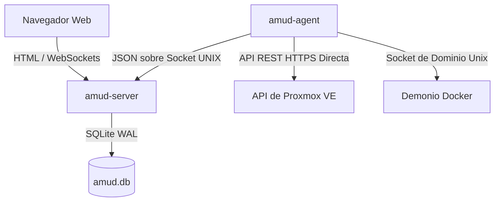

<div align="center">
  
</div>

# AMUD Dashboard

[](https://github.com/boubli/AMUD-Dashboard/releases/latest)

[English](../README.md) | [Español](README.es.md) | [Português](README.pt.md) | [Français](README.fr.md) | [Deutsch](README.de.md) | [Italiano](README.it.md) | [Русский](README.ru.md) | [中文](README.zh.md) | [日本語](README.ja.md) | [हिन्दी](README.hi.md) | [한국어](README.ko.md) | [العربية](README.ar.md)

**[Registro de cambios](https://boubli.github.io/AMUD-Dashboard/docs/changelog)** · **[Blog](https://boubli.github.io/AMUD-Dashboard/blog)** · **[Galería de temas](https://boubli.github.io/AMUD-Dashboard/themes)** · **[Hoja de ruta](https://boubli.github.io/AMUD-Dashboard/docs/roadmap)** · **[Documentación](https://boubli.github.io/AMUD-Dashboard/)** · **[Preguntas frecuentes](https://boubli.github.io/AMUD-Dashboard/docs/faq)**

### Novedades en v1.9.3

- **Clock timezone & format** — Dashboard clock IANA timezone + 12h/24h
- **Custom search engines** — Add your own web search engines (#17)
- **v1.9.2** — Docs currency / 41 themes

Historial completo: **[Registro de cambios](https://boubli.github.io/AMUD-Dashboard/docs/changelog)**

### Estado de versiones

Recomendado ahora: **1.9.3**. Detalles y versiones retiradas: **[README en inglés](../README.md)** (sección Release status).


**Unifica tu homelab.** Un panel rápido, hecho en Rust y sin YAML, con telemetría en vivo de Proxmox y Docker, controles de contenedores e integraciones para los servicios autoalojados más populares — todo desde la interfaz.

A diferencia de los paneles tradicionales (Heimdall, Homepage, Homarr) que se ejecutan en entornos pesados (PHP-FPM, Node.js) y dependen de complejos archivos de configuración YAML anidados, AMUD está escrito en Rust compilado y se almacena por completo en SQLite. Combinados, el servidor y el agente de telemetría consumen en reposo **30–50 MB de RAM** (pico ~150 MB con la cuadrícula de integraciones completa) con una ejecución de rutas en menos de un milisegundo.

## Arquitectura y Decisiones de Diseño

El panel de AMUD se divide en dos binarios nativos:
1. **`amud-server`**: Servidor web basado en Axum que sirve HTML renderizado en el servidor (con plantillas mediante Alpine.js) y gestiona el estado a través de SQLite.
2. **`amud-agent`**: Demonio independiente instalado en el host del homelab. Consulta métricas del host, contenedores Proxmox VE y entornos de ejecución Docker, transmitiendo cargas JSON sin procesar al servidor a través de Sockets de Dominio Unix (UDS) o TCP.



### Justificaciones de la Pila Tecnológica

#### Rust y Axum
* **Sin sobrecarga en tiempo de ejecución**: Se compila directamente a código máquina nativo. Elimina la sobrecarga de inicio y de almacenamiento dinámico (heap) de JVM/V8.
* **Bucle de eventos concurrente (Tokio)**: Los flujos de telemetría y las integraciones de terceros (AdGuard, Pi-hole, Plex, Home Assistant) se consultan de forma concurrente en hilos verdes de Tokio. La telemetría se serializa una vez por ciclo de consulta y se transmite a los WebSockets utilizando un canal `tokio::sync::watch`.

#### Persistencia SQLite (`rusqlite`)
* **Cero YAML**: La configuración se almacena en una base de datos SQLite integrada. Los diseños, las pestañas de categorías y los ajustes se configuran directamente a través de la interfaz de usuario, evitando los dolores de cabeza de la sintaxis YAML.
* **Rendimiento**: Configurado en modo WAL (Write-Ahead Logging), lo que permite lecturas concurrentes y escrituras de baja latencia sin sobrecarga de red externa.

#### Colección Directa de Telemetría
* **Cero subprocesos de shell**: Las soluciones tradicionales crean subprocesos de llamadas al sistema como `pvesh` o `curl` cada pocos segundos para obtener estadísticas de contenedores, lo que genera una alta sobrecarga de CPU.
* **Conectado de forma nativa**: `amud-agent` utiliza `hyper` y `rustls` para enviar llamadas nativas a la API REST de HTTPS a Proxmox VE y lee el demonio de Docker directamente sobre el socket UNIX a través de `hyperlocal`.

---

## Configuración de Telemetría

### Integración con Proxmox VE

Las métricas del host funcionan automáticamente. Para el monitoreo de contenedores LXC, el agente debe estar autenticado en la API REST de Proxmox VE.

#### 1. Generar token de API

En la interfaz web de Proxmox VE:
1. Ve a **Datacenter → Permissions → API Tokens**.
2. Haz clic en **Add**. Selecciona el usuario (por ejemplo, `root@pam`) y el ID del token (por ejemplo, `amud`).
3. **Desmarca** *Privilege Separation* para que el token herede los permisos de auditoría de VM/Sistema del usuario.
4. Copia la clave secreta devuelta.

#### 2. Pasar el token al agente

Configura la variable de entorno en el host que ejecuta el agente:
```bash
PVE_API_TOKEN=PVEAPIToken=root@pam!amud=XXXXXXXX-XXXX-XXXX-XXXX-XXXXXXXXXXXX
```

---

## Despliegue

### Docker Compose

Para hosts en contenedores (combina el servidor y el agente comunicándose a través de un volumen compartido para el socket Unix):

```yaml
version: '3.8'

services:
  app:
    image: tradmss/amud-dashboard:latest
    container_name: amud_app
    restart: always
    ports:
      - "8000:8000"
    environment:
      - PORT=8000
      - BIND_ADDR=0.0.0.0
      - DB_PATH=/app/data/amud.db
      - AMUD_SOCKET_PATH=/var/run/amud/amud.sock
      - AMUD_AGENT_SECRET=change-me-to-a-long-random-string # DEBE coincidir con el secreto del agente a continuación
    cap_drop:
      - ALL
    security_opt:
      - no-new-privileges:true
    volumes:
      - ./data:/app/data
      - amud_run:/var/run/amud

  agent:
    image: tradmss/amud-dashboard:latest
    container_name: amud_agent
    entrypoint: ["/app/amud-agent"]
    restart: always
    environment:
      - AMUD_SOCKET_PATH=/var/run/amud/amud.sock
      - AMUD_AGENT_SECRET=change-me-to-a-long-random-string # DEBE coincidir con el secreto de la aplicación anterior
      - AMUD_DOCKER=1 # Activado automáticamente al montar docker.sock; usa 0 para desactivar
    cap_drop:
      - ALL
    security_opt:
      - no-new-privileges:true
    volumes:
      - amud_run:/var/run/amud
      - /var/run/docker.sock:/var/run/docker.sock:ro

volumes:
  amud_run:
    name: amud_run
```

### Unraid (Community Applications)

Plantillas oficiales: **AMUD Dashboard** + **AMUD Agent** (dos contenedores, ruta de socket compartida).

1. Instala ambos desde la pestaña **Apps** una vez que se publiquen las plantillas.
2. Utiliza el **mismo** `AMUD_AGENT_SECRET` en ambos contenedores.
3. Guía completa: [Docs de instalación en Unraid](https://boubli.github.io/AMUD-Dashboard/docs/installation/unraid)

**¿Error de permisos al primer arranque?** Si el log muestra `.amud-secrets-key: Permission denied`, actualiza a **v1.7.2+** y recrea el contenedor, o consulta [solución de problemas](https://boubli.github.io/AMUD-Dashboard/docs/troubleshooting#unraid-secrets-key-permission-denied) y [permisos de appdata](https://boubli.github.io/AMUD-Dashboard/docs/installation/unraid#permission-errors-on-appdata).

El XML de la plantilla vive en [`templates/`](templates/) con [`ca_profile.xml`](ca_profile.xml) para el envío a Community Applications.

### Script de Piloto Automático Proxmox LXC

Para la instalación nativa dentro de un contenedor LXC de Proxmox VE (ejecutándose fuera de Docker), ejecuta esto en tu host Proxmox VE:
```bash
curl -sSL https://github.com/boubli/AMUD-Dashboard/releases/latest/download/setup-amud.sh | bash
```

---

## Consumo de Recursos en Producción

| Dimensión | Heimdall (PHP Heredado) | AMUD Dashboard (Rust) |
| :--- | :--- | :--- |
| **Motor** | PHP 8+ / Laravel | Rust / Axum / Tokio |
| **Sobrecarga de Ejecución** | Alta (PHP-FPM Interpretado) | Cero (Código Máquina Nativo) |
| **Entrega de Recursos** | Lecturas de disco por solicitud | Incrustado en el binario mediante `include_str!` |
| **Memoria RAM en Reposo** | ~150 MB | **30–50 MB** (pico ~150 MB) |
| **Tiempo de Arranque** | ~2 - 5 segundos | **Sub-milisegundo** |

---

## Soporte y Donación

**Errores y solicitudes de funciones:** [GitHub Issues](https://github.com/boubli/AMUD-Dashboard/issues) (preferido — seguimiento por versión)  
**Preguntas y chat:** [GitHub Discussions](https://github.com/boubli/AMUD-Dashboard/discussions)  
**Documentación / solución de problemas:** [boubli.github.io/AMUD-Dashboard/docs](https://boubli.github.io/AMUD-Dashboard/docs)

* [Patrocinadores de GitHub](https://github.com/sponsors/boubli)
* [Donar a través de Stripe](https://buy.stripe.com/cNi14n6b9a7v5Jg4Rq4ko00)
* [Ko-fi](https://ko-fi.com/Youssefboubli)
