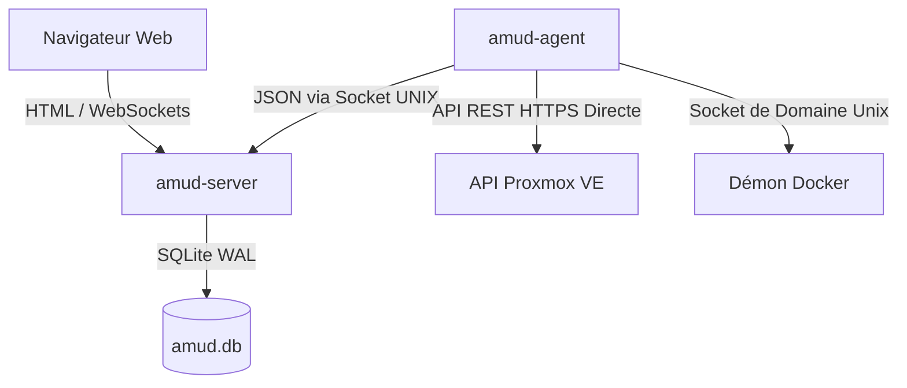

<div align="center">
  
</div>

# AMUD Dashboard

[](https://github.com/boubli/AMUD-Dashboard/releases/latest)

[English](../README.md) | [Español](README.es.md) | [Português](README.pt.md) | [Français](README.fr.md) | [Deutsch](README.de.md) | [Italiano](README.it.md) | [Русский](README.ru.md) | [中文](README.zh.md) | [日本語](README.ja.md) | [हिन्दी](README.hi.md) | [한국어](README.ko.md) | [العربية](README.ar.md)

**[Journal des modifications](https://boubli.github.io/AMUD-Dashboard/docs/changelog)** · **[Blog](https://boubli.github.io/AMUD-Dashboard/blog)** · **[Galerie de thèmes](https://boubli.github.io/AMUD-Dashboard/themes)** · **[Feuille de route](https://boubli.github.io/AMUD-Dashboard/docs/roadmap)** · **[Docs](https://boubli.github.io/AMUD-Dashboard/)** · **[FAQ](https://boubli.github.io/AMUD-Dashboard/docs/faq)**

### Nouveautés de la v1.9.3

- **Clock timezone & format** — Dashboard clock IANA timezone + 12h/24h
- **Custom search engines** — Add your own web search engines (#17)
- **v1.9.2** — Docs currency / 41 themes

Historique complet : **[Journal des modifications](https://boubli.github.io/AMUD-Dashboard/docs/changelog)**

### État des versions

Dernière version recommandée : **1.9.3**. Détails et versions à éviter : **[README anglais](../README.md)** (section Release status).


**Unifiez votre homelab.** Un tableau de bord rapide, propulsé par Rust et sans YAML, avec télémétrie en direct de Proxmox et Docker, contrôles des conteneurs et intégrations pour les services auto-hébergés les plus populaires — le tout depuis l'interface.

Contrairement aux tableaux de bord hérités (Heimdall, Homepage, Homarr) qui s'exécutent sur des environnements lourds (PHP-FPM, Node.js) et s'appuient sur des fichiers de configuration YAML imbriqués et complexes, AMUD est écrit en Rust compilé et ses données sont entièrement persistées dans SQLite. Ensemble, le serveur et l'agent de télémétrie consomment **30 à 50 Mo de RAM** au repos (pic ~150 Mo avec une grille d'intégrations complète), avec un temps d'exécution des requêtes inférieur à la milliseconde.

## Architecture & Décisions de conception

Le tableau de bord AMUD est divisé en deux binaires natifs :
1. **`amud-server`** : Serveur web basé sur Axum qui sert du HTML rendu côté serveur (structuré via Alpine.js) et gère l'état via SQLite.
2. **`amud-agent`** : Démon autonome installé sur l'hôte du homelab. Il interroge les métriques de l'hôte, les conteneurs Proxmox VE et les environnements d'exécution Docker, puis renvoie les charges utiles JSON brutes au serveur via des sockets de domaine Unix (UDS) ou TCP.



### Justifications de la pile technique

#### Rust & Axum
* **Pas de surcharge d'exécution** : Compile directement en code machine natif. Élimine le temps de démarrage et la surcharge de tas (heap) de la JVM/V8.
* **Boucle d'événements concurrente (Tokio)** : Les flux de télémétrie et les intégrations tierces (AdGuard, Pi-hole, Plex, Home Assistant) sont interrogés en arrière-plan de manière concurrente sur des threads légers Tokio. La télémétrie est sérialisée une fois par intervalle d'interrogation et diffusée aux WebSockets à l'aide d'un canal `tokio::sync::watch`.

#### Persistance SQLite (`rusqlite`)
* **Zéro YAML** : La configuration est stockée dans une base de données SQLite intégrée. Les dispositions, les onglets de catégories et les paramètres sont configurés directement depuis l'interface utilisateur, évitant ainsi les maux de tête liés à la syntaxe YAML.
* **Performances** : Configuré en mode WAL (Write-Ahead Logging), permettant des lectures concurrentes et des écritures à faible latence sans la surcharge liée à un réseau externe.

#### Collecte directe de la télémétrie
* **Zéro sous-processus shell** : Les solutions existantes lancent des appels système comme `pvesh` ou `curl` toutes les quelques secondes pour récupérer les statistiques des conteneurs, ce qui entraîne une charge CPU élevée.
* **Réseau natif** : `amud-agent` utilise `hyper` et `rustls` pour envoyer des requêtes API REST HTTPS natives à Proxmox VE, et lit directement le démon Docker via le socket UNIX à l'aide de `hyperlocal`.

---

## Configuration de la télémétrie

### Intégration Proxmox VE

Les métriques de l'hôte fonctionnent automatiquement. Pour la surveillance des conteneurs LXC, l'agent doit être authentifié auprès de l'API REST de Proxmox VE.

#### 1. Générer un jeton d'API (API Token)

Dans l'interface web de Proxmox VE :
1. Accédez à **Datacenter → Permissions → API Tokens**.
2. Cliquez sur **Add**. Sélectionnez l'utilisateur (ex. `root@pam`) et l'ID du jeton (ex. `amud`).
3. **Décochez** *Privilege Separation* pour que le jeton hérite des autorisations d'audit VM/Système de l'utilisateur.
4. Copiez la clé secrète générée.

#### 2. Transmettre le jeton à l'agent

Définissez la variable d'environnement sur l'hôte exécutant l'agent :
```bash
PVE_API_TOKEN=PVEAPIToken=root@pam!amud=XXXXXXXX-XXXX-XXXX-XXXX-XXXXXXXXXXXX
```

---

## Déploiement

### Docker Compose

Pour les hôtes conteneurisés (combine le serveur et l'agent communiquant via un volume partagé pour le socket Unix) :

```yaml
version: '3.8'

services:
  app:
    image: tradmss/amud-dashboard:latest
    container_name: amud_app
    restart: always
    ports:
      - "8000:8000"
    environment:
      - PORT=8000
      - BIND_ADDR=0.0.0.0
      - DB_PATH=/app/data/amud.db
      - AMUD_SOCKET_PATH=/var/run/amud/amud.sock
      - AMUD_AGENT_SECRET=change-me-to-a-long-random-string # DOIT correspondre au secret de l'agent ci-dessous
    cap_drop:
      - ALL
    security_opt:
      - no-new-privileges:true
    volumes:
      - ./data:/app/data
      - amud_run:/var/run/amud

  agent:
    image: tradmss/amud-dashboard:latest
    container_name: amud_agent
    entrypoint: ["/app/amud-agent"]
    restart: always
    environment:
      - AMUD_SOCKET_PATH=/var/run/amud/amud.sock
      - AMUD_AGENT_SECRET=change-me-to-a-long-random-string # DOIT correspondre au secret de l'application ci-dessus
      - AMUD_DOCKER=1 # Activé automatiquement quand docker.sock est monté ; mettre 0 pour désactiver
    cap_drop:
      - ALL
    security_opt:
      - no-new-privileges:true
    volumes:
      - amud_run:/var/run/amud
      - /var/run/docker.sock:/var/run/docker.sock:ro

volumes:
  amud_run:
    name: amud_run
```

### Unraid (Community Applications)

Modèles officiels : **AMUD Dashboard** + **AMUD Agent** (deux conteneurs, chemin de socket partagé).

1. Installez les deux depuis l'onglet **Apps** une fois les modèles publiés.
2. Utilisez le **même** `AMUD_AGENT_SECRET` sur les deux conteneurs.
3. Guide complet : [Documentation d'installation d'Unraid](https://boubli.github.io/AMUD-Dashboard/docs/installation/unraid)

**Erreur de permissions au premier démarrage ?** Si les logs affichent `.amud-secrets-key: Permission denied`, mettez à jour vers **v1.7.2+** et recréez le conteneur, ou consultez le [dépannage](https://boubli.github.io/AMUD-Dashboard/docs/troubleshooting#unraid-secrets-key-permission-denied) et les [permissions appdata](https://boubli.github.io/AMUD-Dashboard/docs/installation/unraid#permission-errors-on-appdata).

Le XML des modèles se trouve dans [`templates/`](templates/) avec [`ca_profile.xml`](ca_profile.xml) pour la soumission à Community Applications.

### Script d'installation automatique Proxmox LXC

Pour une installation native au sein d'un conteneur LXC Proxmox VE (s'exécutant en dehors de Docker), exécutez ceci sur votre hôte Proxmox VE :
```bash
curl -sSL https://github.com/boubli/AMUD-Dashboard/releases/latest/download/setup-amud.sh | bash
```

---

## Empreinte des ressources en production

| Dimension | Heimdall (PHP hérité) | AMUD Dashboard (Rust) |
| :--- | :--- | :--- |
| **Moteur** | PHP 8+ / Laravel | Rust / Axum / Tokio |
| **Surcharge d'exécution** | Élevée (PHP-FPM interprété) | Nulle (Code machine natif) |
| **Livraison des ressources** | Lectures de disque par requête | Intégrée dans le binaire via `include_str!` |
| **RAM au repos** | ~150 Mo | **30–50 Mo** (pic ~150 Mo) |
| **Temps de démarrage**| ~2 - 5 secondes | **Inférieur à la milliseconde** |

---

## Support & Don

**Bugs et demandes de fonctionnalités :** [GitHub Issues](https://github.com/boubli/AMUD-Dashboard/issues) (recommandé — suivi par version)  
**Questions et discussions :** [GitHub Discussions](https://github.com/boubli/AMUD-Dashboard/discussions)  
**Documentation / dépannage :** [boubli.github.io/AMUD-Dashboard/docs](https://boubli.github.io/AMUD-Dashboard/docs)

* [Sponsors GitHub](https://github.com/sponsors/boubli)
* [Faire un don via Stripe](https://buy.stripe.com/cNi14n6b9a7v5Jg4Rq4ko00)
* [Ko-fi](https://ko-fi.com/Youssefboubli)
