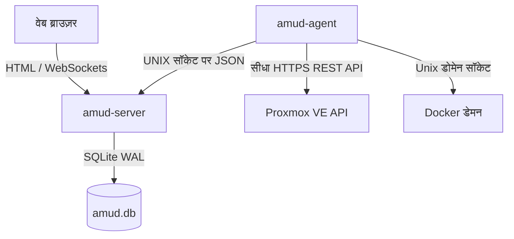

<div align="center">
  
</div>

# AMUD Dashboard

[](https://github.com/boubli/AMUD-Dashboard/releases/latest)

[English](../README.md) | [Español](README.es.md) | [Português](README.pt.md) | [Français](README.fr.md) | [Deutsch](README.de.md) | [Italiano](README.it.md) | [Русский](README.ru.md) | [中文](README.zh.md) | [日本語](README.ja.md) | [हिन्दी](README.hi.md) | [한국어](README.ko.md) | [العربية](README.ar.md)

**[बदलावों की सूची](https://boubli.github.io/AMUD-Dashboard/docs/changelog)** · **[ब्लॉग](https://boubli.github.io/AMUD-Dashboard/blog)** · **[थीम गैलरी](https://boubli.github.io/AMUD-Dashboard/themes)** · **[रोडमैप](https://boubli.github.io/AMUD-Dashboard/docs/roadmap)** · **[दस्तावेज़](https://boubli.github.io/AMUD-Dashboard/)** · **[अक्सर पूछे जाने वाले सवाल](https://boubli.github.io/AMUD-Dashboard/docs/faq)**

### v1.9.3 में नया

- **Clock timezone & format** — Dashboard clock IANA timezone + 12h/24h
- **Custom search engines** — Add your own web search engines (#17)
- **v1.9.2** — Docs currency / 41 themes

पूरा इतिहास: **[चेंजलॉग](https://boubli.github.io/AMUD-Dashboard/docs/changelog)**

### रिलीज़ स्थिति

अनुशंसित: **1.9.3**. विवरण: **[अंग्रेज़ी README](../README.md)** (Release status अनुभाग)।


**अपने होमलैब को एकीकृत करें।** Rust से बना तेज़, बिना-YAML वाला डैशबोर्ड — Proxmox और Docker की लाइव टेलीमेट्री, कंटेनर नियंत्रण, और लोकप्रिय सेल्फ-होस्टेड सेवाओं के लिए इंटीग्रेशन, सब कुछ UI से।

पुराने डैशबोर्ड (Heimdall, Homepage, Homarr) जो भारी रनटाइम्स (PHP-FPM, Node.js) पर चलते हैं और जटिल नेस्टेड YAML कॉन्फ़िगरेशन फ़ाइलों पर निर्भर करते हैं, उनके विपरीत, AMUD को संकलित Rust में लिखा गया है और पूरी तरह से SQLite में संग्रहीत किया जाता है। खाली रहने पर सर्वर और टेलीमेट्री एजेंट मिलकर **30–50 MB RAM** (पूर्ण इंटीग्रेशन ग्रिड पर चरम ~150 MB) का उपयोग करते हैं और रूट निष्पादन उप-मिलीसेकंड में होता है।

## वास्तुकला और डिज़ाइन निर्णय

AMUD डैशबोर्ड को दो मूल बायनेरिज़ (native binaries) में विभाजित किया गया है:
1. **`amud-server`**: SQLite के माध्यम से स्थिति प्रबंधित करने वाला और सर्वर-रेंडर किए गए HTML (Alpine.js के माध्यम से टेम्पलेट किए गए) को परोसने वाला Axum-आधारित वेब सर्वर।
2. **`amud-agent`**: होमलैब होस्ट पर स्थापित होने वाला स्टैंडअलोन डेमन। यह होस्ट मेट्रिक्स, Proxmox VE कंटेनर, और Docker रनटाइम्स को क्वेरी करता है, और Unix डोमेन सॉकेट्स (UDS) या TCP के माध्यम से कच्चे JSON पेलोड को वापस सर्वर पर स्ट्रीम करता है।



### तकनीकी स्टैक के चयन के कारण

#### Rust और Axum
* **कोई रनटाइम ओवरहेड नहीं**: सीधे मूल मशीन कोड (native machine code) में संकलित होता है। JVM/V8 स्टार्टअप और हीप ओवरहेड को समाप्त करता है।
* **समवर्ती घटना चक्र (Tokio)**: टेलीमेट्री स्ट्रीम और तीसरे पक्ष के एकीकरण (AdGuard, Pi-hole, Plex, Home Assistant) Tokio ग्रीन थ्रेड्स पर समवर्ती रूप से पोल होते हैं। टेलीमेट्री को प्रति पोल टिक में एक बार सीरियलाइज़ किया जाता है और `tokio::sync::watch` चैनल का उपयोग करके WebSockets पर प्रसारित किया जाता।

#### SQLite निरंतरता (`rusqlite`)
* **शून्य YAML**: कॉन्फ़िगरेशन एक एम्बेडेड SQLite डेटाबेस में संग्रहीत किया जाता है। लेआउट, श्रेणी टैब और सेटिंग्स सीधे UI के माध्यम से कॉन्फ़िगर की जाती हैं, जिससे YAML सिंटैक्स के सिरदर्द से बचा जा सकता है।
* **प्रदर्शन**: WAL (Write-Ahead Logging) मोड में कॉन्फ़िगर किया गया है, जो बाहरी नेटवर्क ओवरहेड के बिना समवर्ती रीड और कम-विलंबता राइट (low-latency writes) को सक्षम बनाता है।

#### प्रत्यक्ष टेलीमेट्री संग्रह
* **शून्य शेल उपप्रक्रियाएं (Shell Subprocesses)**: पुराने समाधान कंटेनर आँकड़ों को प्राप्त करने के लिए हर कुछ सेकंड में `pvesh` या `curl` जैसे सिस्टम कॉल को फ़ॉर्क करते हैं, जिससे उच्च CPU ओवरहेड होता है।
* **मूल रूप से नेटवर्क से जुड़ा**: `amud-agent` Proxmox VE को मूल HTTPS REST API कॉल भेजने के लिए `hyper` और `rustls` का उपयोग करता है और `hyperlocal` के माध्यम से सीधे UNIX सॉकेट पर Docker डेमन को पढ़ता है।

---

## टेलीमेट्री कॉन्फ़िगरेशन

### Proxmox VE एकीकरण

होस्ट मेट्रिक्स स्वचालित रूप से कार्य करते हैं। LXC कंटेनर निगरानी के लिए, एजेंट को Proxmox VE REST API में प्रमाणित होना चाहिए।

#### 1. API टोकन उत्पन्न करें

Proxmox VE वेब UI में:
1. **Datacenter → Permissions → API Tokens** पर जाएं।
2. **Add** पर क्लिक करें। यूजर (जैसे, `root@pam`) और टोकन आईडी (जैसे, `amud`) चुनें।
3. **Privilege Separation** को *अनचेक* करें ताकि टोकन यूजर के VM/सिस्टम ऑडिट अनुमतियों को इनहेरिट कर सके।
4. वापस मिली सीक्रेट की (Secret key) को कॉपी करें।

#### 2. एजेंट को टोकन पास करें

एजेंट चलाने वाले होस्ट पर पर्यावरण चर (environment variable) सेट करें:
```bash
PVE_API_TOKEN=PVEAPIToken=root@pam!amud=XXXXXXXX-XXXX-XXXX-XXXX-XXXXXXXXXXXX
```

---

## परिनियोजन (Deployment)

### Docker Compose

कंटेनर वाले होस्ट के लिए (सर्वर और एजेंट को जोड़ता है जो यूनिक्स सॉकेट के लिए साझा वॉल्यूम पर संचार करते हैं):

```yaml
version: '3.8'

services:
  app:
    image: tradmss/amud-dashboard:latest
    container_name: amud_app
    restart: always
    ports:
      - "8000:8000"
    environment:
      - PORT=8000
      - BIND_ADDR=0.0.0.0
      - DB_PATH=/app/data/amud.db
      - AMUD_SOCKET_PATH=/var/run/amud/amud.sock
      - AMUD_AGENT_SECRET=change-me-to-a-long-random-string # नीचे दिए गए एजेंट सीक्रेट से मेल खाना चाहिए
    cap_drop:
      - ALL
    security_opt:
      - no-new-privileges:true
    volumes:
      - ./data:/app/data
      - amud_run:/var/run/amud

  agent:
    image: tradmss/amud-dashboard:latest
    container_name: amud_agent
    entrypoint: ["/app/amud-agent"]
    restart: always
    environment:
      - AMUD_SOCKET_PATH=/var/run/amud/amud.sock
      - AMUD_AGENT_SECRET=change-me-to-a-long-random-string # ऊपर दिए गए ऐप सीक्रेट से मेल खाना चाहिए
      - AMUD_DOCKER=1 # docker.sock माउंट पर स्वतः सक्षम; अक्षम करने के लिए 0
    cap_drop:
      - ALL
    security_opt:
      - no-new-privileges:true
    volumes:
      - amud_run:/var/run/amud
      - /var/run/docker.sock:/var/run/docker.sock:ro

volumes:
  amud_run:
    name: amud_run
```

### Unraid (Community Applications)

आधिकारिक टेम्पलेट: **AMUD Dashboard** + **AMUD Agent** (दो कंटेनर, साझा सॉकेट पथ)।

1. टेम्पलेट प्रकाशित होने के बाद **Apps** टैब से दोनों को स्थापित करें।
2. दोनों कंटेनरों पर **समान** `AMUD_AGENT_SECRET` का उपयोग करें।
3. संपूर्ण गाइड: [Unraid स्थापना दस्तावेज़](https://boubli.github.io/AMUD-Dashboard/docs/installation/unraid)

**पहले बूट पर अनुमति त्रुटि?** यदि लॉग में `.amud-secrets-key: Permission denied` दिखे, **v1.7.2+** पर अपडेट करें और कंटेनर पुनः बनाएं, या [समस्या निवारण](https://boubli.github.io/AMUD-Dashboard/docs/troubleshooting#unraid-secrets-key-permission-denied) और [appdata अनुमतियाँ](https://boubli.github.io/AMUD-Dashboard/docs/installation/unraid#permission-errors-on-appdata) देखें।

टेम्पलेट XML, Community Applications में जमा करने के लिए [`ca_profile.xml`](ca_profile.xml) के साथ [`templates/`](templates/) में रहता है।

### Proxmox LXC ऑटोपायलट स्क्रिप्ट

Proxmox VE LXC कंटेनर (जो डॉकर के बाहर चल रहा है) के भीतर मूल स्थापना के लिए, इसे अपने Proxmox VE होस्ट पर चलाएं:
```bash
curl -sSL https://github.com/boubli/AMUD-Dashboard/releases/latest/download/setup-amud.sh | bash
```

---

## उत्पादन संसाधन फुटप्रिंट (Production Resource Footprint)

| आयाम | Heimdall (पुराना PHP) | AMUD Dashboard (Rust) |
| :--- | :--- | :--- |
| **इंजन** | PHP 8+ / Laravel | Rust / Axum / Tokio |
| **निष्पादन ओवरहेड** | उच्च (व्याख्या की गई PHP-FPM) | शून्य (मूल मशीन कोड) |
| **एसेट डिलीवरी** | प्रति अनुरोध डिस्क रीड | `include_str!` के माध्यम से बाइनरी में एम्बेडेड |
| **खाली रैम फुटप्रिंट** | ~150MB | **30–50 MB** (चरम ~150 MB) |
| **स्टार्टअप समय** | ~2 - 5 सेकंड | **उप-मिलीसेकंड** |

---

## समर्थन और दान

**बग और फ़ीचर अनुरोध:** [GitHub Issues](https://github.com/boubli/AMUD-Dashboard/issues) (पसंदीदा — प्रति रिलीज़ ट्रैक)  
**प्रश्न और चैट:** [GitHub Discussions](https://github.com/boubli/AMUD-Dashboard/discussions)  
**दस्तावेज़ / समस्या निवारण:** [boubli.github.io/AMUD-Dashboard/docs](https://boubli.github.io/AMUD-Dashboard/docs)

* [GitHub Sponsors](https://github.com/sponsors/boubli)
* [Stripe के माध्यम से दान करें](https://buy.stripe.com/cNi14n6b9a7v5Jg4Rq4ko00)
* [Ko-fi](https://ko-fi.com/Youssefboubli)
