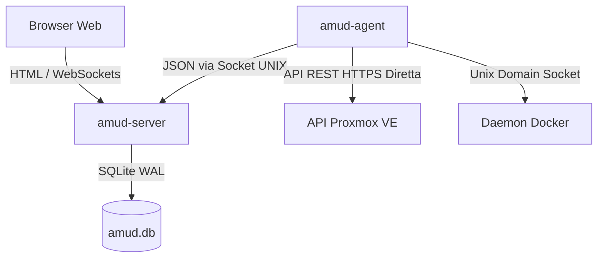

<div align="center">
  
</div>

# AMUD Dashboard

[](https://github.com/boubli/AMUD-Dashboard/releases/latest)

[English](../README.md) | [Español](README.es.md) | [Português](README.pt.md) | [Français](README.fr.md) | [Deutsch](README.de.md) | [Italiano](README.it.md) | [Русский](README.ru.md) | [中文](README.zh.md) | [日本語](README.ja.md) | [हिन्दी](README.hi.md) | [한국어](README.ko.md) | [العربية](README.ar.md)

**[Registro delle modifiche](https://boubli.github.io/AMUD-Dashboard/docs/changelog)** · **[Blog](https://boubli.github.io/AMUD-Dashboard/blog)** · **[Galleria dei Temi](https://boubli.github.io/AMUD-Dashboard/themes)** · **[Tabella di marcia](https://boubli.github.io/AMUD-Dashboard/docs/roadmap)** · **[Documentazione](https://boubli.github.io/AMUD-Dashboard/)** · **[FAQ](https://boubli.github.io/AMUD-Dashboard/docs/faq)**

### Novità in v1.9.3

- **Clock timezone & format** — Dashboard clock IANA timezone + 12h/24h
- **Custom search engines** — Add your own web search engines (#17)
- **v1.9.2** — Docs currency / 41 themes

Cronologia completa: **[Changelog](https://boubli.github.io/AMUD-Dashboard/docs/changelog)**

### Stato release

Consigliato: **1.9.3**. Dettagli e tag ritirati: **[README inglese](../README.md)** (sezione Release status).


**Unifica il tuo homelab.** Una dashboard veloce, scritta in Rust e senza YAML, con telemetria live di Proxmox e Docker, controlli dei container e integrazioni per i più diffusi servizi self-hosted — tutto dall'interfaccia.

A differenza delle vecchie dashboard (Heimdall, Homepage, Homarr) che girano su runtime pesanti (PHP-FPM, Node.js) e dipendono da complessi file di configurazione YAML annidati, AMUD è scritto in Rust compilato e persiste interamente su SQLite. Insieme, il server e l'agente di telemetria consumano a riposo **30–50 MB di RAM** (picco ~150 MB con griglia integrazioni completa) con tempi di risposta inferiori al millisecondo.

## Architettura e Scelte di Progettazione

La dashboard AMUD è divisa in due binari nativi:
1. **`amud-server`**: Server web basato su Axum che serve HTML renderizzato lato server (con template via Alpine.js) e gestisce lo stato tramite SQLite.
2. **`amud-agent`**: Daemon autonomo installato sull'host homelab. Raccoglie metriche dell'host, container Proxmox VE e runtime Docker, inviando i dati JSON al server tramite Unix Domain Socket (UDS) o TCP.



### Scelte Tecnologiche

#### Rust & Axum
* **Nessun runtime overhead**: Compila direttamente in codice macchina nativo. Elimina il tempo di avvio e l'overhead di memoria (heap) di JVM/V8.
* **Loop degli eventi concorrente (Tokio)**: I flussi di telemetria e le integrazioni esterne (AdGuard, Pi-hole, Plex, Home Assistant) vengono interrogati in parallelo sui thread verdi di Tokio. I dati di telemetria vengono serializzati a ogni intervallo di polling e distribuiti ai WebSocket usando un canale `tokio::sync::watch`.

#### Persistenza su SQLite (`rusqlite`)
* **Zero YAML**: La configurazione è memorizzata all'interno di un database SQLite integrato. Layout, categorie e impostazioni sono configurati direttamente tramite l'interfaccia grafica, evitando la complessità dei file YAML.
* **Prestazioni**: Configurato in modalità WAL (Write-Ahead Logging), consentendo letture concorrenti e scritture a bassa latenza senza sovraccarichi legati alla rete.

#### Raccolta Diretta della Telemetria
* **Nessun sottoprocesso shell**: Le vecchie soluzioni eseguono comandi come `pvesh` o `curl` ogni pochi secondi per ottenere le statistiche dei container, causando un consumo elevato di CPU.
* **Rete nativa**: `amud-agent` utilizza `hyper` e `rustls` per inviare richieste API REST HTTPS native a Proxmox VE e legge direttamente il daemon Docker tramite socket UNIX usando `hyperlocal`.

---

## Configurazione della Telemetria

### Integrazione Proxmox VE

Le metriche dell'host funzionano automaticamente. Per monitorare i container LXC, l'agente deve essere autenticato sulle API REST di Proxmox VE.

#### 1. Generare un Token API

Nell'interfaccia web di Proxmox VE:
1. Navigare su **Datacenter → Permissions → API Tokens**.
2. Fare clic su **Add**. Selezionare l'utente (es. `root@pam`) e l'ID del Token (es. `amud`).
3. **Deselezionare** *Privilege Separation* in modo che il token erediti i permessi di controllo del sistema e delle VM dell'utente.
4. Copiare la chiave segreta (Secret) generata.

#### 2. Passare il Token all'Agente

Configurare la variabile d'ambiente sull'host che esegue l'agente:
```bash
PVE_API_TOKEN=PVEAPIToken=root@pam!amud=XXXXXXXX-XXXX-XXXX-XXXX-XXXXXXXXXXXX
```

---

## Installazione

### Docker Compose

Per gli host containerizzati (combina server e agente che comunicano tramite una cartella condivisa per il socket Unix):

```yaml
version: '3.8'

services:
  app:
    image: tradmss/amud-dashboard:latest
    container_name: amud_app
    restart: always
    ports:
      - "8000:8000"
    environment:
      - PORT=8000
      - BIND_ADDR=0.0.0.0
      - DB_PATH=/app/data/amud.db
      - AMUD_SOCKET_PATH=/var/run/amud/amud.sock
      - AMUD_AGENT_SECRET=change-me-to-a-long-random-string # DEVE corrispondere alla chiave segreta dell'agente sotto
    cap_drop:
      - ALL
    security_opt:
      - no-new-privileges:true
    volumes:
      - ./data:/app/data
      - amud_run:/var/run/amud

  agent:
    image: tradmss/amud-dashboard:latest
    container_name: amud_agent
    entrypoint: ["/app/amud-agent"]
    restart: always
    environment:
      - AMUD_SOCKET_PATH=/var/run/amud/amud.sock
      - AMUD_AGENT_SECRET=change-me-to-a-long-random-string # DEVE corrispondere alla chiave segreta dell'applicazione sopra
      - AMUD_DOCKER=1 # Abilitato automaticamente con docker.sock montato; impostare 0 per disabilitare
    cap_drop:
      - ALL
    security_opt:
      - no-new-privileges:true
    volumes:
      - amud_run:/var/run/amud
      - /var/run/docker.sock:/var/run/docker.sock:ro

volumes:
  amud_run:
    name: amud_run
```

### Unraid (Community Applications)

Template ufficiali: **AMUD Dashboard** + **AMUD Agent** (due container, percorso socket condiviso).

1. Installare entrambi dalla scheda **Apps** una volta che i template sono pubblicati.
2. Utilizzare lo **stesso** `AMUD_AGENT_SECRET` su entrambi i container.
3. Guida completa: [Documentazione di installazione su Unraid](https://boubli.github.io/AMUD-Dashboard/docs/installation/unraid)

**Errore di permessi al primo avvio?** Se il log mostra `.amud-secrets-key: Permission denied`, aggiorna a **v1.7.2+** e ricrea il container, oppure consulta [risoluzione problemi](https://boubli.github.io/AMUD-Dashboard/docs/troubleshooting#unraid-secrets-key-permission-denied) e [permessi appdata](https://boubli.github.io/AMUD-Dashboard/docs/installation/unraid#permission-errors-on-appdata).

I file XML dei template si trovano in [`templates/`](templates/) con [`ca_profile.xml`](ca_profile.xml) per l'invio su Community Applications.

### Script di installazione automatica Proxmox LXC

Per l'installazione nativa all'interno di un container LXC su Proxmox VE (eseguito fuori da Docker), eseguire questo comando sull'host Proxmox VE:
```bash
curl -sSL https://github.com/boubli/AMUD-Dashboard/releases/latest/download/setup-amud.sh | bash
```

---

## Risorse in Produzione

| Dimensione | Heimdall (PHP Legacy) | AMUD Dashboard (Rust) |
| :--- | :--- | :--- |
| **Motore** | PHP 8+ / Laravel | Rust / Axum / Tokio |
| **Overhead di Esecuzione**| Alto (PHP-FPM Interpretato) | Zero (Codice macchina nativo) |
| **Distribuzione Risorse**| Letture da disco per richiesta | Incorporate nel binario via `include_str!` |
| **Uso RAM a Riposo** | ~150 MB | **30–50 MB** (picco ~150 MB) |
| **Tempo di Avvio**| ~2 - 5 secondi | **Inferiore al millisecondo** |

---

## Supporto e Donazione

**Bug e richieste di funzionalità:** [GitHub Issues](https://github.com/boubli/AMUD-Dashboard/issues) (preferito — tracciati per release)  
**Domande e chat:** [GitHub Discussions](https://github.com/boubli/AMUD-Dashboard/discussions)  
**Documentazione / risoluzione problemi:** [boubli.github.io/AMUD-Dashboard/docs](https://boubli.github.io/AMUD-Dashboard/docs)

* [GitHub Sponsors](https://github.com/sponsors/boubli)
* [Dona tramite Stripe](https://buy.stripe.com/cNi14n6b9a7v5Jg4Rq4ko00)
* [Ko-fi](https://ko-fi.com/Youssefboubli)
