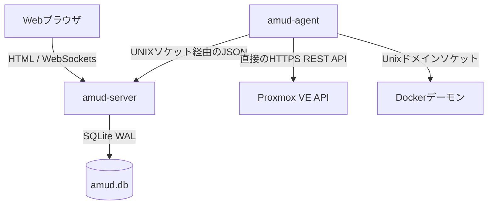

<div align="center">
  
</div>

# AMUD Dashboard

[](https://github.com/boubli/AMUD-Dashboard/releases/latest)

[English](../README.md) | [Español](README.es.md) | [Português](README.pt.md) | [Français](README.fr.md) | [Deutsch](README.de.md) | [Italiano](README.it.md) | [Русский](README.ru.md) | [中文](README.zh.md) | [日本語](README.ja.md) | [हिन्दी](README.hi.md) | [한국어](README.ko.md) | [العربية](README.ar.md)

**[変更履歴](https://boubli.github.io/AMUD-Dashboard/docs/changelog)** · **[ブログ](https://boubli.github.io/AMUD-Dashboard/blog)** · **[テーマギャラリー](https://boubli.github.io/AMUD-Dashboard/themes)** · **[ロードマップ](https://boubli.github.io/AMUD-Dashboard/docs/roadmap)** · **[ドキュメント](https://boubli.github.io/AMUD-Dashboard/)** · **[FAQ](https://boubli.github.io/AMUD-Dashboard/docs/faq)**

### v1.9.3 の新機能

- **Clock timezone & format** — Dashboard clock IANA timezone + 12h/24h
- **Custom search engines** — Add your own web search engines (#17)
- **v1.9.2** — Docs currency / 41 themes

履歴: **[変更履歴](https://boubli.github.io/AMUD-Dashboard/docs/changelog)**

### リリース状況

推奨バージョン: **1.9.3**。詳細は **[英語 README](../README.md)**（Release status）を参照。


**ホームラボを統合。** Rust 製で高速、YAML 不要のダッシュボード。Proxmox と Docker のリアルタイムテレメトリ、コンテナ操作、人気のセルフホストサービスとの連携を、すべて UI から。

重いランタイム（PHP-FPM、Node.js）で動作し、複雑なネストされたYAML設定ファイルに依存する従来のダッシュボード（Heimdall、Homepage、Homarr）とは異なり、AMUDはコンパイル済みのRustで書かれており、完全にSQLiteに保存されます。サーバーとテレメトリエージェントはアイドル時 **30–50 MB RAM**（統合グリッド満載時のピーク約 150 MB）で、ルート実行速度はミリ秒未満です。

## アーキテクチャと設計決定

AMUDダッシュボードは、2つのネイティブバイナリに分割されています。
1. **`amud-server`**: サーバー側でレンダリングされたHTML（Alpine.js経由でテンプレート化）を提供し、SQLite経由で状態を管理するAxumベースのWebサーバー。
2. **`amud-agent`**: ホームラボのホストにインストールされるスタンドアロンデーモン。ホストメトリクス、Proxmox VEコンテナ、Dockerランタイムをクエリし、Unixドメインソケット（UDS）またはTCPを介して生のJSONペイロードをサーバーに送り返します。



### 技術スタックの選定理由

#### Rust & Axum
* **ランタイムオーバーヘッドなし**: ネイティブマシンコードに直接コンパイルされます。JVM/V8の起動やヒープのオーバーヘッドを排除します。
* **並行イベントループ（Tokio）**: テレメトリストリームとサードパーティの統合（AdGuard、Pi-hole、Plex、Home Assistant）は、Tokioのグリーンスレッド上で並行してポーリングされます。テレメトリはポーリングごとに1回シリアル化され、`tokio::sync::watch` チャンネルを使用してWebSocketにブロードキャストされます。

#### SQLiteによる永続化 (`rusqlite`)
* **YAML不要**: 設定は組み込みのSQLiteデータベースに保存されます。レイアウト、カテゴリタブ、設定はUIから直接設定でき、YAMLの構文エラーの悩みを回避できます。
* **パフォーマンス**: WAL（Write-Ahead Logging）モードで構成されており、外部ネットワークのオーバーヘッドなしで、並行読み取りと低レイテンシの書き込みが可能です。

#### 直接テレメトリ収集
* **シェルサブプロセスの排除**: 従来のソリューションは、コンテナの統計情報を取得するために数秒ごとに `pvesh` や `curl` などのシステムコールをフォークするため、高いCPUオーバーヘッドが発生します。
* **ネイティブなネットワーク接続**: `amud-agent` は `hyper` と `rustls` を使用してネイティブのHTTPS REST API呼び出しを Proxmox VE に送信し、`hyperlocal` を介してUNIXソケット上で直接 Docker デーモンを読み取ります。

---

## テレメトリ設定

### Proxmox VEの統合

ホストメトリクスは自動的に機能します。LXCコンテナの監視では、エージェントが Proxmox VE REST API に対して認証されている必要があります。

#### 1. APIトークンの生成

Proxmox VEのWeb UIで以下を行います。
1. **データセンター → アクセス権限 → APIトークン** に移動します。
2. **追加** をクリックします。ユーザー（例: `root@pam`）とトークンID（例: `amud`）を選択します。
3. トークンがユーザーのVM/システム監査権限を継承するように、**「特権の分離」のチェックを外します**。
4. 返された秘密鍵（Secret key）をコピーします。

#### 2. エージェントへのトークンの受け渡し

エージェントを実行しているホストで環境変数を設定します。
```bash
PVE_API_TOKEN=PVEAPIToken=root@pam!amud=XXXXXXXX-XXXX-XXXX-XXXX-XXXXXXXXXXXX
```

---

## デプロイ

### Docker Compose

コンテナ化されたホスト用（Unixソケット用の共有ボリュームを介して通信するサーバーとエージェントの組み合わせ）:

```yaml
version: '3.8'

services:
  app:
    image: tradmss/amud-dashboard:latest
    container_name: amud_app
    restart: always
    ports:
      - "8000:8000"
    environment:
      - PORT=8000
      - BIND_ADDR=0.0.0.0
      - DB_PATH=/app/data/amud.db
      - AMUD_SOCKET_PATH=/var/run/amud/amud.sock
      - AMUD_AGENT_SECRET=change-me-to-a-long-random-string # 下のエージェントの秘密鍵と一致する必要があります
    cap_drop:
      - ALL
    security_opt:
      - no-new-privileges:true
    volumes:
      - ./data:/app/data
      - amud_run:/var/run/amud

  agent:
    image: tradmss/amud-dashboard:latest
    container_name: amud_agent
    entrypoint: ["/app/amud-agent"]
    restart: always
    environment:
      - AMUD_SOCKET_PATH=/var/run/amud/amud.sock
      - AMUD_AGENT_SECRET=change-me-to-a-long-random-string # 上のアプリの秘密鍵と一致する必要があります
      - AMUD_DOCKER=1 # docker.sock マウント時に自動有効；無効化は 0
    cap_drop:
      - ALL
    security_opt:
      - no-new-privileges:true
    volumes:
      - amud_run:/var/run/amud
      - /var/run/docker.sock:/var/run/docker.sock:ro

volumes:
  amud_run:
    name: amud_run
```

### Unraid (Community Applications)

公式テンプレート: **AMUD Dashboard** + **AMUD Agent** (2つのコンテナ、共有ソケットパス)。

1. テンプレートが公開された後、**Apps** タブから両方をインストールします。
2. 両方のコンテナで **同じ** `AMUD_AGENT_SECRET` を使用します。
3. 完全なガイド: [Unraidインストール文書](https://boubli.github.io/AMUD-Dashboard/docs/installation/unraid)

**初回起動の権限エラー？** ログに `.amud-secrets-key: Permission denied` と出る場合は **v1.7.2+** に更新してコンテナを再作成するか、[トラブルシューティング](https://boubli.github.io/AMUD-Dashboard/docs/troubleshooting#unraid-secrets-key-permission-denied)と [appdata 権限](https://boubli.github.io/AMUD-Dashboard/docs/installation/unraid#permission-errors-on-appdata)を参照してください。

テンプレートXMLは [`templates/`](templates/) にあり、Community Applicationsへの提出用の [`ca_profile.xml`](ca_profile.xml) が含まれています。

### Proxmox LXCオートパイロットスクリプト

Proxmox VE LXCコンテナ内へのネイティブインストール（Dockerの外部で実行）の場合、Proxmox VEホストでこれを実行します。
```bash
curl -sSL https://github.com/boubli/AMUD-Dashboard/releases/latest/download/setup-amud.sh | bash
```

---

## 本番環境でのリソースフットプリント

| 次元 | Heimdall (旧PHP) | AMUD Dashboard (Rust) |
| :--- | :--- | :--- |
| **エンジン** | PHP 8+ / Laravel | Rust / Axum / Tokio |
| **実行オーバーヘッド** | 高（解釈型PHP-FPM） | ゼロ（ネイティブマシンコード） |
| **アセット配信** | リクエストごとのディスク読み込み | `include_str!` によりバイナリに埋め込み |
| **アイドル時RAM使用量**| ~150MB | **30–50 MB** (ピーク ~150 MB) |
| **起動時間**| ~2 - 5 秒 | **ミリ秒未満** |

---

## サポートと寄付

**バグと機能リクエスト：** [GitHub Issues](https://github.com/boubli/AMUD-Dashboard/issues)（推奨 — リリースごとに追跡）  
**質問とチャット：** [GitHub Discussions](https://github.com/boubli/AMUD-Dashboard/discussions)  
**ドキュメント / トラブルシューティング：** [boubli.github.io/AMUD-Dashboard/docs](https://boubli.github.io/AMUD-Dashboard/docs)

* [GitHub Sponsors](https://github.com/sponsors/boubli)
* [Stripe経由での寄付](https://buy.stripe.com/cNi14n6b9a7v5Jg4Rq4ko00)
* [Ko-fi](https://ko-fi.com/Youssefboubli)
