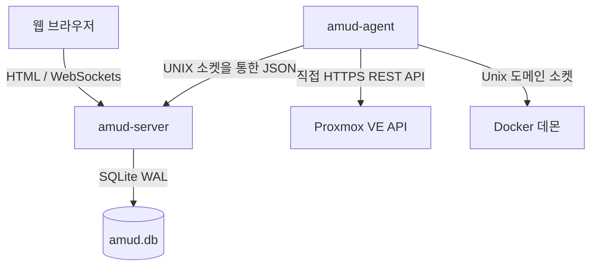

<div align="center">
  
</div>

# AMUD Dashboard

[](https://github.com/boubli/AMUD-Dashboard/releases/latest)

[English](../README.md) | [Español](README.es.md) | [Português](README.pt.md) | [Français](README.fr.md) | [Deutsch](README.de.md) | [Italiano](README.it.md) | [Русский](README.ru.md) | [中文](README.zh.md) | [日本語](README.ja.md) | [हिन्दी](README.hi.md) | [한국어](README.ko.md) | [العربية](README.ar.md)

**[변경 로그](https://boubli.github.io/AMUD-Dashboard/docs/changelog)** · **[블로그](https://boubli.github.io/AMUD-Dashboard/blog)** · **[테마 갤러리](https://boubli.github.io/AMUD-Dashboard/themes)** · **[로드맵](https://boubli.github.io/AMUD-Dashboard/docs/roadmap)** · **[문서](https://boubli.github.io/AMUD-Dashboard/)** · **[FAQ](https://boubli.github.io/AMUD-Dashboard/docs/faq)**

### v1.9.3 새로운 기능

- **Clock timezone & format** — Dashboard clock IANA timezone + 12h/24h
- **Custom search engines** — Add your own web search engines (#17)
- **v1.9.2** — Docs currency / 41 themes

전체 기록: **[변경 로그](https://boubli.github.io/AMUD-Dashboard/docs/changelog)**

### 릴리스 상태

권장 버전: **1.9.3**. 자세한 내용: **[영어 README](../README.md)** (Release status 섹션).


**홈랩을 하나로.** Rust로 만든 빠르고 YAML이 필요 없는 대시보드로, Proxmox와 Docker 실시간 텔레메트리, 컨테이너 제어, 인기 있는 셀프호스팅 서비스 연동을 모두 UI에서 제공합니다.

무거운 런타임(PHP-FPM, Node.js)에서 실행되고 복잡하게 중첩된 YAML 설정 파일에 의존하는 기존 대시보드(Heimdall, Homepage, Homarr)와 달리, AMUD는 컴파일된 Rust로 작성되었으며 데이터는 SQLite에 완전히 영구 저장됩니다. 서버와 원격 측정 에이전트는 대기 상태에서 **30–50 MB RAM**(전체 통합 그리드 시 피크 ~150 MB)을 사용하며, 라우팅 실행 속도는 밀리초 미만입니다.

## 아키텍처 및 설계 결정

AMUD 대시보드는 두 개의 기본 바이너리로 나뉩니다.
1. **`amud-server`**: 서버 측에서 렌더링된 HTML(Alpine.js 기반 템플릿)을 제공하고 SQLite를 통해 상태를 관리하는 Axum 기반 웹 서버.
2. **`amud-agent`**: 홈랩 호스트에 설치되는 독립 실행형 데몬. 호스트 메트릭, Proxmox VE 컨테이너, Docker 런타임을 쿼리하고 Unix 도메인 소켓(UDS) 또는 TCP를 통해 원시 JSON 페이로드를 서버로 다시 스트리밍합니다.



### 기술 스택 선정 이유

#### Rust & Axum
* **런타임 오버헤드 없음**: 기본 기계어로 직접 컴파일됩니다. JVM/V8 시작 및 힙 오버헤드를 제거합니다.
* **동시 이벤트 루프(Tokio)**: 원격 측정 스트림 및 타사 통합(AdGuard, Pi-hole, Plex, Home Assistant)은 Tokio 그린 스레드에서 동시에 폴링됩니다. 원격 측정 데이터는 폴링 주기마다 한 번씩 직렬화되어 `tokio::sync::watch` 채널을 통해 WebSocket으로 브로드캐스트됩니다.

#### SQLite를 통한 지속성 (`rusqlite`)
* **YAML 없음**: 설정은 내장 SQLite 데이터베이스에 저장됩니다. 레이아웃, 카테고리 탭, 설정은 UI에서 직접 구성할 수 있어 YAML 구문 오류로 인한 골칫거리를 피할 수 있습니다.
* **성능**: WAL(Write-Ahead Logging) 모드로 구성되어 외부 네트워크 오버헤드 없이 동시 읽기 및 대기 시간이 짧은 쓰기가 가능합니다.

#### 직접 원격 측정 수집
* **셸 하위 프로세스 없음**: 기존 솔루션은 컨테이너 통계를 가져오기 위해 몇 초마다 `pvesh` 또는 `curl`과 같은 시스템 호출을 포크하므로 CPU 오버헤드가 크게 발생합니다.
* **기본 네트워크 통신**: `amud-agent`는 `hyper` 및 `rustls`를 사용하여 Proxmox VE에 직접 HTTPS REST API 호출을 전송하고, `hyperlocal`을 통해 UNIX 소켓에서 직접 Docker 데몬을 읽습니다.

---

## 원격 측정 설정

### Proxmox VE 통합

호스트 메트릭은 자동으로 작동합니다. LXC 컨테이너를 모니터링하려면 에이전트가 Proxmox VE REST API에 인증되어야 합니다.

#### 1. API 토큰 생성

Proxmox VE 웹 UI에서 다음을 수행합니다.
1. **데이터 센터 → 권한 → API 토큰**으로 이동합니다.
2. **추가**를 클릭합니다. 사용자(예: `root@pam`) 및 토큰 ID(예: `amud`)를 선택합니다.
3. 토큰이 사용자의 VM/시스템 감사 권한을 상속하도록 **"권한 분리"를 선택 취소**합니다.
4. 반환된 비밀 키(Secret key)를 복사합니다.

#### 2. 에이전트에 토큰 전달

에이전트를 실행하는 호스트에서 환경 변수를 설정합니다.
```bash
PVE_API_TOKEN=PVEAPIToken=root@pam!amud=XXXXXXXX-XXXX-XXXX-XXXX-XXXXXXXXXXXX
```

---

## 배포

### Docker Compose

컨테이너화된 호스트의 경우(Unix 소켓을 위한 공유 볼륨을 통해 통신하는 서버와 에이전트의 결합):

```yaml
version: '3.8'

services:
  app:
    image: tradmss/amud-dashboard:latest
    container_name: amud_app
    restart: always
    ports:
      - "8000:8000"
    environment:
      - PORT=8000
      - BIND_ADDR=0.0.0.0
      - DB_PATH=/app/data/amud.db
      - AMUD_SOCKET_PATH=/var/run/amud/amud.sock
      - AMUD_AGENT_SECRET=change-me-to-a-long-random-string # 아래의 에이전트 비밀 키와 일치해야 합니다
    cap_drop:
      - ALL
    security_opt:
      - no-new-privileges:true
    volumes:
      - ./data:/app/data
      - amud_run:/var/run/amud

  agent:
    image: tradmss/amud-dashboard:latest
    container_name: amud_agent
    entrypoint: ["/app/amud-agent"]
    restart: always
    environment:
      - AMUD_SOCKET_PATH=/var/run/amud/amud.sock
      - AMUD_AGENT_SECRET=change-me-to-a-long-random-string # 위의 앱 비밀 키와 일치해야 합니다
      - AMUD_DOCKER=1 # docker.sock 마운트 시 자동 활성화; 비활성화는 0
    cap_drop:
      - ALL
    security_opt:
      - no-new-privileges:true
    volumes:
      - amud_run:/var/run/amud
      - /var/run/docker.sock:/var/run/docker.sock:ro

volumes:
  amud_run:
    name: amud_run
```

### Unraid (Community Applications)

공식 템플릿: **AMUD Dashboard** + **AMUD Agent** (두 개의 컨테이너, 소켓 경로 공유).

1. 템플릿이 게시된 후 **Apps** 탭에서 두 컨테이너를 모두 설치합니다.
2. 두 컨테이너 모두에 **동일한** `AMUD_AGENT_SECRET`을 사용합니다.
3. 전체 가이드: [Unraid 설치 문서](https://boubli.github.io/AMUD-Dashboard/docs/installation/unraid)

**첫 부팅 권한 오류?** 로그에 `.amud-secrets-key: Permission denied`가 보이면 **v1.7.2+**로 업데이트 후 컨테이너를 재생성하거나 [문제 해결](https://boubli.github.io/AMUD-Dashboard/docs/troubleshooting#unraid-secrets-key-permission-denied) 및 [appdata 권한](https://boubli.github.io/AMUD-Dashboard/docs/installation/unraid#permission-errors-on-appdata)을 참고하세요.

템플릿 XML은 [`templates/`](templates/)에 위치하며, Community Applications 제출용 [`ca_profile.xml`](ca_profile.xml)과 함께 제공됩니다.

### Proxmox LXC 자동 가이드 스크립트

Proxmox VE LXC 컨테이너(Docker 외부에서 실행) 내의 기본 설치의 경우, Proxmox VE 호스트에서 다음을 실행합니다.
```bash
curl -sSL https://github.com/boubli/AMUD-Dashboard/releases/latest/download/setup-amud.sh | bash
```

---

## 프로덕션 리소스 사용량

| 구분 | Heimdall (기존 PHP) | AMUD Dashboard (Rust) |
| :--- | :--- | :--- |
| **엔진** | PHP 8+ / Laravel | Rust / Axum / Tokio |
| **실행 오버헤드** | 높음 (인터프리터 PHP-FPM) | 없음 (기본 기계어) |
| **에셋 전달** | 요청당 디스크 읽기 | `include_str!`를 통해 바이나리에 포함됨 |
| **대기 상태 RAM 점유**| ~150MB | **30–50 MB** (피크 ~150 MB) |
| **시작 시간**| ~2 - 5초 | **밀리초 미만** |

---

## 지원 및 후원

**버그 및 기능 요청:** [GitHub Issues](https://github.com/boubli/AMUD-Dashboard/issues) (권장 — 릴리스별 추적)  
**질문 및 채팅:** [GitHub Discussions](https://github.com/boubli/AMUD-Dashboard/discussions)  
**문서 / 문제 해결:** [boubli.github.io/AMUD-Dashboard/docs](https://boubli.github.io/AMUD-Dashboard/docs)

* [GitHub Sponsors](https://github.com/sponsors/boubli)
* [Stripe을 통한 기부](https://buy.stripe.com/cNi14n6b9a7v5Jg4Rq4ko00)
* [Ko-fi](https://ko-fi.com/Youssefboubli)
