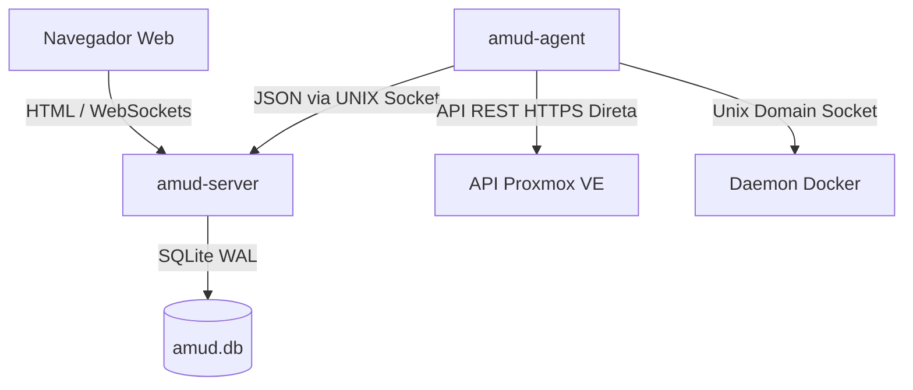

<div align="center">
  
</div>

# AMUD Dashboard

[](https://github.com/boubli/AMUD-Dashboard/releases/latest)

[English](../README.md) | [Español](README.es.md) | [Português](README.pt.md) | [Français](README.fr.md) | [Deutsch](README.de.md) | [Italiano](README.it.md) | [Русский](README.ru.md) | [中文](README.zh.md) | [日本語](README.ja.md) | [हिन्दी](README.hi.md) | [한국어](README.ko.md) | [العربية](README.ar.md)

**[Changelog](https://boubli.github.io/AMUD-Dashboard/docs/changelog)** · **[Blog](https://boubli.github.io/AMUD-Dashboard/blog)** · **[Galeria de Temas](https://boubli.github.io/AMUD-Dashboard/themes)** · **[Roadmap](https://boubli.github.io/AMUD-Dashboard/docs/roadmap)** · **[Documentação](https://boubli.github.io/AMUD-Dashboard/)** · **[FAQ](https://boubli.github.io/AMUD-Dashboard/docs/faq)**

### Novidades na v1.9.3

- **Clock timezone & format** — Dashboard clock IANA timezone + 12h/24h
- **Custom search engines** — Add your own web search engines (#17)
- **v1.9.2** — Docs currency / 41 themes

Histórico completo: **[Changelog](https://boubli.github.io/AMUD-Dashboard/docs/changelog)**

### Estado da versão

Recomendado: **1.9.3**. Detalhes e tags retiradas: **[README em inglês](../README.md)** (secção Release status).


**Unifique seu homelab.** Um painel rápido, feito em Rust e sem YAML, com telemetria ao vivo de Proxmox e Docker, controles de contêineres e integrações para os serviços auto-hospedados mais populares — tudo pela interface.

Ao contrário dos painéis legados (Heimdall, Homepage, Homarr) que rodam em runtimes pesados (PHP-FPM, Node.js) e dependem de arquivos complexos de configuração YAML aninhados, o AMUD é escrito em Rust compilado e persistido inteiramente em SQLite. Juntos, o servidor e o agente de telemetria consomem em repouso **30–50 MB de RAM** (pico ~150 MB com a grade de integrações completa), com execução de rotas em submilisegundos.

## Arquitetura & Decisões de Design

O painel AMUD é dividido em dois binários nativos:
1. **`amud-server`**: Servidor web baseado em Axum que serve HTML renderizado no servidor (com templates via Alpine.js) e gerencia o estado através do SQLite.
2. **`amud-agent`**: Daemon independente instalado no host homelab. Ele consulta métricas do host, contêineres Proxmox VE e runtimes do Docker, enviando payloads JSON brutos de volta ao servidor através de Unix Domain Sockets (UDS) ou TCP.



### Justificativas da Pilha Tecnológica

#### Rust & Axum
* **Sem Sobrecarga de Runtime**: Compila diretamente para código de máquina nativo. Elimina a sobrecarga de inicialização e gerenciamento de memória (heap) do JVM/V8.
* **Loop de Eventos Concorrente (Tokio)**: Streams de telemetria e integrações de terceiros (AdGuard, Pi-hole, Plex, Home Assistant) são consultados concorrentemente nas threads verdes do Tokio. A telemetria é serializada uma vez a cada ciclo de polling e transmitida aos WebSockets usando um canal `tokio::sync::watch`.

#### Persistência com SQLite (`rusqlite`)
* **Zero YAML**: A configuração é armazenada em um banco de dados SQLite embutido. Layouts, abas de categorias e configurações são modificados diretamente pela interface do usuário, eliminando problemas de sintaxe do YAML.
* **Performance**: Configurado no modo WAL (Write-Ahead Logging), permitindo leituras concorrentes e gravações de baixa latência sem sobrecarga de rede externa.

#### Coleta Direta de Telemetria
* **Zero Subprocessos Shell**: Soluções legadas usam sub-processos do sistema como `pvesh` ou `curl` a cada poucos segundos para coletar estatísticas de contêineres, resultando em alto uso de CPU.
* **Comunicação Nativa**: O `amud-agent` utiliza `hyper` e `rustls` para enviar requisições nativas de API REST HTTPS ao Proxmox VE e lê o daemon do Docker diretamente através do socket UNIX via `hyperlocal`.

---

## Configuração de Telemetria

### Integração com Proxmox VE

As métricas do host funcionam automaticamente. Para o monitoramento de contêineres LXC, o agente deve estar autenticado na API REST do Proxmox VE.

#### 1. Gerar Token de API

Na interface Web do Proxmox VE:
1. Vá em **Datacenter → Permissions → API Tokens**.
2. Clique em **Add**. Selecione o usuário (ex: `root@pam`) e o Token ID (ex: `amud`).
3. **Desmarque** a opção *Privilege Separation* para que o token herde as permissões de auditoria de VM/Sistema do usuário.
4. Copie a chave secreta gerada.

#### 2. Passar o Token ao Agente

Defina a variável de ambiente no host executando o agente:
```bash
PVE_API_TOKEN=PVEAPIToken=root@pam!amud=XXXXXXXX-XXXX-XXXX-XXXX-XXXXXXXXXXXX
```

---

## Implantação

### Docker Compose

Para hosts rodando contêineres (combina servidor e agente comunicando-se via volume compartilhado para o socket Unix):

```yaml
version: '3.8'

services:
  app:
    image: tradmss/amud-dashboard:latest
    container_name: amud_app
    restart: always
    ports:
      - "8000:8000"
    environment:
      - PORT=8000
      - BIND_ADDR=0.0.0.0
      - DB_PATH=/app/data/amud.db
      - AMUD_SOCKET_PATH=/var/run/amud/amud.sock
      - AMUD_AGENT_SECRET=change-me-to-a-long-random-string # DEVE corresponder ao segredo do agente abaixo
    cap_drop:
      - ALL
    security_opt:
      - no-new-privileges:true
    volumes:
      - ./data:/app/data
      - amud_run:/var/run/amud

  agent:
    image: tradmss/amud-dashboard:latest
    container_name: amud_agent
    entrypoint: ["/app/amud-agent"]
    restart: always
    environment:
      - AMUD_SOCKET_PATH=/var/run/amud/amud.sock
      - AMUD_AGENT_SECRET=change-me-to-a-long-random-string # DEBE corresponder ao segredo do app acima
      - AMUD_DOCKER=1 # Ativado automaticamente ao montar docker.sock; use 0 para desativar
    cap_drop:
      - ALL
    security_opt:
      - no-new-privileges:true
    volumes:
      - amud_run:/var/run/amud
      - /var/run/docker.sock:/var/run/docker.sock:ro

volumes:
  amud_run:
    name: amud_run
```

### Unraid (Community Applications)

Modelos oficiais: **AMUD Dashboard** + **AMUD Agent** (dois contêineres, caminho de socket compartilhado).

1. Instale ambos através da aba **Apps** após os modelos estarem publicados.
2. Use o **mesmo** `AMUD_AGENT_SECRET` em ambos os contêineres.
3. Guia completo: [Docs de instalação no Unraid](https://boubli.github.io/AMUD-Dashboard/docs/installation/unraid)

**Erro de permissão na primeira inicialização?** Se o log mostrar `.amud-secrets-key: Permission denied`, atualize para **v1.7.2+** e recrie o contêiner, ou consulte [solução de problemas](https://boubli.github.io/AMUD-Dashboard/docs/troubleshooting#unraid-secrets-key-permission-denied) e [permissões do appdata](https://boubli.github.io/AMUD-Dashboard/docs/installation/unraid#permission-errors-on-appdata).

Os XMLs dos modelos ficam em [`templates/`](templates/) com [`ca_profile.xml`](ca_profile.xml) para envio ao Community Applications.

### Script LXC Autopilot do Proxmox

Para instalação nativa em um contêiner LXC do Proxmox VE (fora do Docker), execute isto no seu host Proxmox VE:
```bash
curl -sSL https://github.com/boubli/AMUD-Dashboard/releases/latest/download/setup-amud.sh | bash
```

---

## Consumo de Recursos em Produção

| Dimensão | Heimdall (PHP Legado) | AMUD Dashboard (Rust) |
| :--- | :--- | :--- |
| **Motor** | PHP 8+ / Laravel | Rust / Axum / Tokio |
| **Sobrecarga de Execução** | Alta (PHP-FPM Interpretado) | Zero (Código de Máquina Nativo) |
| **Entrega de Recursos** | Leitura de disco por requisição | Embutidos no binário via `include_str!` |
| **Uso de RAM Ocioso** | ~150MB | **30–50 MB** (pico ~150 MB) |
| **Tempo de Inicialização**| ~2 - 5 segundos | **Submilisegundo** |

---

## Suporte & Doação

**Bugs e pedidos de recursos:** [GitHub Issues](https://github.com/boubli/AMUD-Dashboard/issues) (preferido — acompanhado por versão)  
**Perguntas e chat:** [GitHub Discussions](https://github.com/boubli/AMUD-Dashboard/discussions)  
**Documentação / resolução de problemas:** [boubli.github.io/AMUD-Dashboard/docs](https://boubli.github.io/AMUD-Dashboard/docs)

* [GitHub Sponsors](https://github.com/sponsors/boubli)
* [Doar via Stripe](https://buy.stripe.com/cNi14n6b9a7v5Jg4Rq4ko00)
* [Ko-fi](https://ko-fi.com/Youssefboubli)
