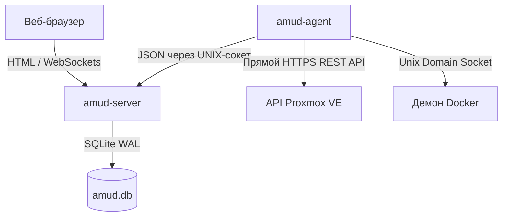

<div align="center">
  
</div>

# AMUD Dashboard

[](https://github.com/boubli/AMUD-Dashboard/releases/latest)

[English](../README.md) | [Español](README.es.md) | [Português](README.pt.md) | [Français](README.fr.md) | [Deutsch](README.de.md) | [Italiano](README.it.md) | [Русский](README.ru.md) | [中文](README.zh.md) | [日本語](README.ja.md) | [हिन्दी](README.hi.md) | [한국어](README.ko.md) | [العربية](README.ar.md)

**[Список изменений](https://boubli.github.io/AMUD-Dashboard/docs/changelog)** · **[Блог](https://boubli.github.io/AMUD-Dashboard/blog)** · **[Галерея тем](https://boubli.github.io/AMUD-Dashboard/themes)** · **[План разработки](https://boubli.github.io/AMUD-Dashboard/docs/roadmap)** · **[Документация](https://boubli.github.io/AMUD-Dashboard/)** · **[FAQ](https://boubli.github.io/AMUD-Dashboard/docs/faq)**

### Что нового в v1.9.3

- **Clock timezone & format** — Dashboard clock IANA timezone + 12h/24h
- **Custom search engines** — Add your own web search engines (#17)
- **v1.9.2** — Docs currency / 41 themes

Полная история: **[Журнал изменений](https://boubli.github.io/AMUD-Dashboard/docs/changelog)**

### Статус релизов

Рекомендуется: **1.9.3**. Подробности и отозванные теги: **[английский README](../README.md)** (раздел Release status).


**Объедините свою домашнюю лабораторию.** Быстрая панель на Rust без YAML: телеметрия Proxmox и Docker в реальном времени, управление контейнерами и интеграции с популярными self-hosted сервисами — всё через интерфейс.

В отличие от устаревших панелей (Heimdall, Homepage, Homarr), работающих на тяжелых средах выполнения (PHP-FPM, Node.js) и полагающихся на сложные вложенные файлы конфигурации YAML, AMUD написан на скомпилированном Rust и полностью сохраняет данные в SQLite. В связке сервер и агент телеметрии в режиме простоя потребляют **30–50 МБ ОЗУ** (пик ~150 МБ при полной сетке интеграций), а время обработки маршрутов составляет менее миллисекунды.

## Архитектура и проектные решения

Панель мониторинга AMUD разделена на два нативных исполняемых файла:
1. **`amud-server`**: веб-сервер на базе Axum, отдающий HTML с рендерингом на стороне сервера (шаблонизация через Alpine.js) и управляющий состоянием через SQLite.
2. **`amud-agent`**: автономный демон, устанавливаемый на хост домашней лаборатории. Он опрашивает метрики хоста, контейнеры Proxmox VE и среды выполнения Docker, передавая необработанные JSON-данные обратно на сервер через сокеты домена Unix (UDS) или TCP.



### Обоснование технологического стека

#### Rust и Axum
* **Отсутствие накладных расходов во время выполнения**: компилируется непосредственно в нативный машинный код. Исключает накладные расходы на запуск и кучу (heap) JVM/V8.
* **Конкурентный цикл обработки событий (Tokio)**: потоки телеметрии и сторонние интеграции (AdGuard, Pi-hole, Plex, Home Assistant) опрашиваются параллельно в «зеленых» потоках Tokio. Данные телеметрии сериализуются один раз за такт опроса и транслируются в WebSockets с использованием канала `tokio::sync::watch`.

#### Хранение данных в SQLite (`rusqlite`)
* **Никакого YAML**: конфигурация хранится во встроенной базе данных SQLite. Макеты, вкладки категорий и настройки настраиваются непосредственно через веб-интерфейс, избавляя вас от проблем с синтаксисом YAML.
* **Производительность**: настроено в режиме WAL (Write-Ahead Logging), что обеспечивает параллельное чтение и запись с низкой задержкой без накладных расходов на внешнюю сеть.

#### Прямой сбор телеметрии
* **Никаких подпроцессов командной оболочки**: устаревшие решения каждые несколько секунд запускают системные вызовы вроде `pvesh` или `curl` для получения статистики контейнеров, что приводит к высокой нагрузке на процессор.
* **Нативная работа с сетью**: `amud-agent` использует библиотеки `hyper` и `rustls` для отправки нативных запросов к REST API HTTPS Proxmox VE и напрямую опрашивает демон Docker через UNIX-сокет с помощью библиотеки `hyperlocal`.

---

## Настройка телеметрии

### Интеграция с Proxmox VE

Метрики хоста работают автоматически. Для мониторинга контейнеров LXC агент должен быть авторизован в REST API Proxmox VE.

#### 1. Создание токена API

В веб-интерфейсе Proxmox VE:
1. Перейдите в **Datacenter → Permissions → API Tokens**.
2. Нажмите **Add**. Выберите пользователя (например, `root@pam`) и Token ID (например, `amud`).
3. **Снимите флажок** *Privilege Separation*, чтобы токен унаследовал права пользователя на аудит виртуальных машин и системы.
4. Скопируйте полученный секретный ключ (Secret key).

#### 2. Передача токена агенту

Задайте переменную окружения на хосте, где запущен агент:
```bash
PVE_API_TOKEN=PVEAPIToken=root@pam!amud=XXXXXXXX-XXXX-XXXX-XXXX-XXXXXXXXXXXX
```

---

## Развертывание

### Docker Compose

Для контейнеризованных хостов (объединяет сервер и агент, общающиеся через общий том для сокета Unix):

```yaml
version: '3.8'

services:
  app:
    image: tradmss/amud-dashboard:latest
    container_name: amud_app
    restart: always
    ports:
      - "8000:8000"
    environment:
      - PORT=8000
      - BIND_ADDR=0.0.0.0
      - DB_PATH=/app/data/amud.db
      - AMUD_SOCKET_PATH=/var/run/amud/amud.sock
      - AMUD_AGENT_SECRET=change-me-to-a-long-random-string # ДОЛЖЕН совпадать с секретом агента ниже
    cap_drop:
      - ALL
    security_opt:
      - no-new-privileges:true
    volumes:
      - ./data:/app/data
      - amud_run:/var/run/amud

  agent:
    image: tradmss/amud-dashboard:latest
    container_name: amud_agent
    entrypoint: ["/app/amud-agent"]
    restart: always
    environment:
      - AMUD_SOCKET_PATH=/var/run/amud/amud.sock
      - AMUD_AGENT_SECRET=change-me-to-a-long-random-string # ДОЛЖЕН совпадать с секретом приложения выше
      - AMUD_DOCKER=1 # Включается автоматически при монтировании docker.sock; 0 — отключить
    cap_drop:
      - ALL
    security_opt:
      - no-new-privileges:true
    volumes:
      - amud_run:/var/run/amud
      - /var/run/docker.sock:/var/run/docker.sock:ro

volumes:
  amud_run:
    name: amud_run
```

### Unraid (Community Applications)

Официальные шаблоны: **AMUD Dashboard** + **AMUD Agent** (два контейнера, общий путь к сокету).

1. Установите оба контейнера из вкладки **Apps** после публикации шаблонов.
2. Используйте **один и тот же** `AMUD_AGENT_SECRET` в обоих контейнерах.
3. Полное руководство: [Документация по установке в Unraid](https://boubli.github.io/AMUD-Dashboard/docs/installation/unraid)

**Ошибка прав при первом запуске?** Если в логе `.amud-secrets-key: Permission denied`, обновитесь до **v1.7.2+** и пересоздайте контейнер или см. [устранение неполадок](https://boubli.github.io/AMUD-Dashboard/docs/troubleshooting#unraid-secrets-key-permission-denied) и [права appdata](https://boubli.github.io/AMUD-Dashboard/docs/installation/unraid#permission-errors-on-appdata).

Файлы XML шаблонов находятся в папке [`templates/`](templates/), а [`ca_profile.xml`](ca_profile.xml) используется для публикации в каталоге Community Applications.

### Скрипт автоустановки Proxmox LXC

Для нативной установки внутри контейнера LXC Proxmox VE (без использования Docker) выполните на вашем хосте Proxmox VE следующую команду:
```bash
curl -sSL https://github.com/boubli/AMUD-Dashboard/releases/latest/download/setup-amud.sh | bash
```

---

## Потребление ресурсов в рабочей среде

| Параметр | Heimdall (устаревший PHP) | AMUD Dashboard (Rust) |
| :--- | :--- | :--- |
| **Движок** | PHP 8+ / Laravel | Rust / Axum / Tokio |
| **Накладные расходы** | Высокие (интерпретируемый PHP-FPM) | Нулевые (нативный машинный код) |
| **Отдача ресурсов** | Чтение с диска при каждом запросе | Встроены в исполняемый файл через `include_str!` |
| **ОЗУ в простое** | ~150 МБ | **30–50 МБ** (пик ~150 МБ) |
| **Время запуска** | ~2 - 5 секунд | **Менее миллисекунды** |

---

## Поддержка и пожертвования

**Ошибки и запросы функций:** [GitHub Issues](https://github.com/boubli/AMUD-Dashboard/issues) (предпочтительно — отслеживаются по релизам)  
**Вопросы и обсуждения:** [GitHub Discussions](https://github.com/boubli/AMUD-Dashboard/discussions)  
**Документация / устранение неполадок:** [boubli.github.io/AMUD-Dashboard/docs](https://boubli.github.io/AMUD-Dashboard/docs)

* [GitHub Sponsors](https://github.com/sponsors/boubli)
* [Поддержать через Stripe](https://buy.stripe.com/cNi14n6b9a7v5Jg4Rq4ko00)
* [Ko-fi](https://ko-fi.com/Youssefboubli)
