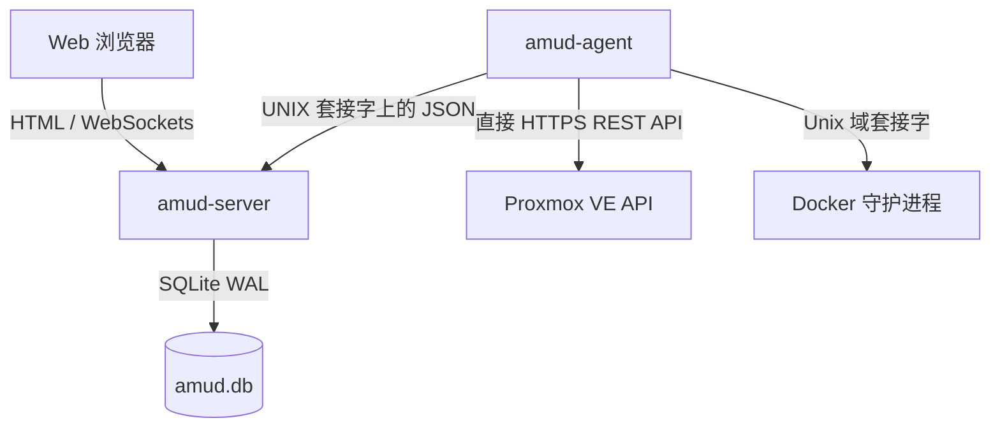

<div align="center">
  
</div>

# AMUD Dashboard

[](https://github.com/boubli/AMUD-Dashboard/releases/latest)

[English](../README.md) | [Español](README.es.md) | [Português](README.pt.md) | [Français](README.fr.md) | [Deutsch](README.de.md) | [Italiano](README.it.md) | [Русский](README.ru.md) | [中文](README.zh.md) | [日本語](README.ja.md) | [हिन्दी](README.hi.md) | [한국어](README.ko.md) | [العربية](README.ar.md)

**[更新日志](https://boubli.github.io/AMUD-Dashboard/docs/changelog)** · **[博客](https://boubli.github.io/AMUD-Dashboard/blog)** · **[主题画廊](https://boubli.github.io/AMUD-Dashboard/themes)** · **[路线图](https://boubli.github.io/AMUD-Dashboard/docs/roadmap)** · **[文档](https://boubli.github.io/AMUD-Dashboard/)** · **[常见问题](https://boubli.github.io/AMUD-Dashboard/docs/faq)**

### v1.9.3 新特性

- **Clock timezone & format** — Dashboard clock IANA timezone + 12h/24h
- **Custom search engines** — Add your own web search engines (#17)
- **v1.9.2** — Docs currency / 41 themes

完整历史：**[更新日志](https://boubli.github.io/AMUD-Dashboard/docs/changelog)**

### 版本状态

当前推荐：**1.9.3**。详情与已撤回版本：见 **[英文 README](../README.md)**（Release status 部分）。


**统一你的家庭实验室。** 一个快速、基于 Rust、零 YAML 的仪表板，提供 Proxmox 与 Docker 实时遥测、容器控制，以及对热门自托管服务的集成——全部通过界面完成。

与运行在笨重运行时（PHP-FPM、Node.js）并依赖复杂的嵌套 YAML 配置文件的主流仪表板（Heimdall、Homepage、Homarr）不同，AMUD 采用编译型 Rust 编写，并完全持久化在 SQLite 中。服务器和遥测代理在空闲时合计 **30–50 MB RAM**（完整集成网格峰值约 150 MB），路由执行时间在亚毫秒级。

## 架构与设计决策

AMUD Dashboard 拆分为两个原生二进制文件：
1. **`amud-server`**：基于 Axum 的 Web 服务器，负责提供服务器端渲染的 HTML（通过 Alpine.js 模版化），并通过 SQLite 管理状态。
2. **`amud-agent`**：安装在家庭实验室主机上的独立守护进程。它查询主机指标、Proxmox VE 容器和 Docker 运行时，并通过 Unix 域套接字 (UDS) 或 TCP 将原始 JSON 负载流式传输回服务器。



### 技术栈决策合理性

#### Rust & Axum
* **无运行时开销**：直接编译为原生机器码。消除 JVM/V8 启动和堆 (heap) 开销。
* **并发事件循环 (Tokio)**：遥测流和第三方集成（AdGuard、Pi-hole、Plex、Home Assistant）在 Tokio 绿色线程上并发轮询。遥测数据在每次轮询 tick 时序列化一次，并使用 `tokio::sync::watch` 通道广播到 WebSockets。

#### SQLite 持久化 (`rusqlite`)
* **零 YAML**：配置存储在嵌入式 SQLite 数据库中。布局、分类标签和设置直接通过 UI 进行配置，避开了 YAML 语法排错的烦恼。
* **性能**：配置为 WAL（预写日志）模式，支持并发读取和低延迟写入，无需外部网络开销。

#### 直接遥测收集
* **零 Shell 子进程**：传统方案每隔几秒就会 fork 一次系统调用（如 `pvesh` 或 `curl`）来抓取容器状态，导致高 CPU 开销。
* **原生网络通信**：`amud-agent` 利用 `hyper` 和 `rustls` 向 Proxmox VE 发送原生的 HTTPS REST API 调用，并使用 `hyperlocal` 直接通过 UNIX 套接字读取 Docker 守护进程。

---

## 遥测配置

### Proxmox VE 集成

主机指标自动运行。如需监控 LXC 容器，代理必须通过 Proxmox VE REST API 的身份验证。

#### 1. 生成 API 令牌

在 Proxmox VE Web UI 中：
1. 导航至 **Datacenter → Permissions → API Tokens**。
2. 点击 **Add**。选择用户（例如 `root@pam`）和令牌 ID（例如 `amud`）。
3. **取消勾选** *Privilege Separation*，以便令牌继承该用户的虚拟机/系统审计权限。
4. 复制返回的密钥 (Secret key)。

#### 2. 将令牌传递给代理

在运行代理的主机上设置环境变量：
```bash
PVE_API_TOKEN=PVEAPIToken=root@pam!amud=XXXXXXXX-XXXX-XXXX-XXXX-XXXXXXXXXXXX
```

---

## 部署

### Docker Compose

对于容器化主机（结合服务器和代理，通过共享的 Unix 套接字卷进行通信）：

```yaml
version: '3.8'

services:
  app:
    image: tradmss/amud-dashboard:latest
    container_name: amud_app
    restart: always
    ports:
      - "8000:8000"
    environment:
      - PORT=8000
      - BIND_ADDR=0.0.0.0
      - DB_PATH=/app/data/amud.db
      - AMUD_SOCKET_PATH=/var/run/amud/amud.sock
      - AMUD_AGENT_SECRET=change-me-to-a-long-random-string # 必须与下方的代理密钥一致
    cap_drop:
      - ALL
    security_opt:
      - no-new-privileges:true
    volumes:
      - ./data:/app/data
      - amud_run:/var/run/amud

  agent:
    image: tradmss/amud-dashboard:latest
    container_name: amud_agent
    entrypoint: ["/app/amud-agent"]
    restart: always
    environment:
      - AMUD_SOCKET_PATH=/var/run/amud/amud.sock
      - AMUD_AGENT_SECRET=change-me-to-a-long-random-string # 必须与上方的应用密钥一致
      - AMUD_DOCKER=1 # 挂载 docker.sock 时自动启用；设为 0 可禁用
    cap_drop:
      - ALL
    security_opt:
      - no-new-privileges:true
    volumes:
      - amud_run:/var/run/amud
      - /var/run/docker.sock:/var/run/docker.sock:ro

volumes:
  amud_run:
    name: amud_run
```

### Unraid (Community Applications)

官方模板：**AMUD Dashboard** + **AMUD Agent**（两个容器，共享套接字路径）。

1. 模板发布后，从 **Apps** 标签页安装这两个容器。
2. 在两个容器上使用**相同**的 `AMUD_AGENT_SECRET`。
3. 完整指南：[Unraid 安装文档](https://boubli.github.io/AMUD-Dashboard/docs/installation/unraid)

**首次启动权限错误？** 若日志出现 `.amud-secrets-key: Permission denied`，请更新到 **v1.7.2+** 并重建容器，或查看[故障排除](https://boubli.github.io/AMUD-Dashboard/docs/troubleshooting#unraid-secrets-key-permission-denied)与 [appdata 权限](https://boubli.github.io/AMUD-Dashboard/docs/installation/unraid#permission-errors-on-appdata)。

模板 XML 位于 [`templates/`](templates/)，附带用于提交到 Community Applications 的 [`ca_profile.xml`](ca_profile.xml)。

### Proxmox LXC 自动引导脚本

如果要在 Proxmox VE LXC 容器内进行原生安装（运行在 Docker 之外），请在 Proxmox VE 主机上执行以下命令：
```bash
curl -sSL https://github.com/boubli/AMUD-Dashboard/releases/latest/download/setup-amud.sh | bash
```

---

## 生产资源占用

| 维度 | Heimdall (旧版 PHP) | AMUD Dashboard (Rust) |
| :--- | :--- | :--- |
| **引擎** | PHP 8+ / Laravel | Rust / Axum / Tokio |
| **运行开销** | 高 (解释型 PHP-FPM) | 零 (原生机器码) |
| **静态资源分发** | 每次请求读取磁盘 | 通过 `include_str!` 嵌入二进制文件中 |
| **空闲 RAM 占用** | ~150MB | **30–50 MB**（峰值 ~150 MB） |
| **启动时间**| ~2 - 5 秒 | **亚毫秒级** |

---

## 支持与赞助

**错误与功能请求：** [GitHub Issues](https://github.com/boubli/AMUD-Dashboard/issues)（首选 — 按版本跟踪）  
**问题与讨论：** [GitHub Discussions](https://github.com/boubli/AMUD-Dashboard/discussions)  
**文档 / 故障排除：** [boubli.github.io/AMUD-Dashboard/docs](https://boubli.github.io/AMUD-Dashboard/docs)

* [GitHub 赞助](https://github.com/sponsors/boubli)
* [通过 Stripe 捐赠](https://buy.stripe.com/cNi14n6b9a7v5Jg4Rq4ko00)
* [Ko-fi](https://ko-fi.com/Youssefboubli)
